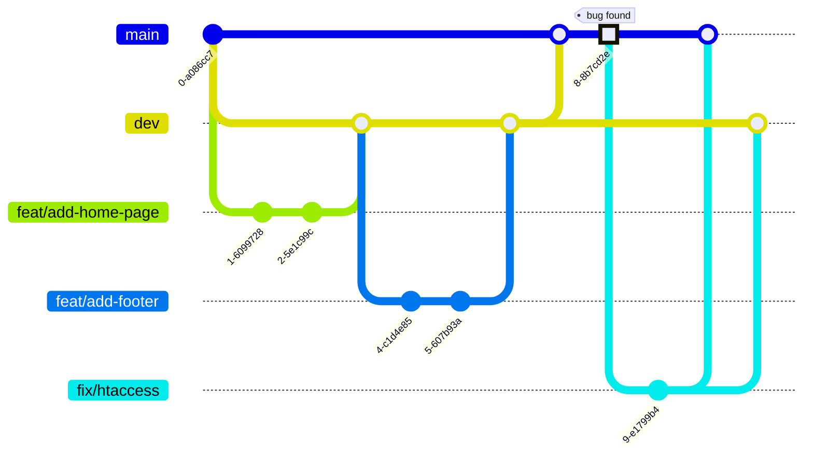

# Contributing to marsAI

## Welcome

Thank you for your interest in contributing to **marsAI**, the platform 
for the first international 1-minute AI-generated short film festival.

Whether you're fixing a bug, proposing a new feature, improving documentation, 
or writing tests, every contribution helps make this project better. 
This guide will walk you through the process of contributing.

If you have any questions, feel free to 
[open an issue](https://github.com/ebouchut/mars-ai-project/issues) on GitHub.

## Before You Start

### Code of Conduct

Make sure you read and agree to our [Code of Conduct](CODE_OF_CONDUCT.md).

### Prerequisites for Development

Read the [Prerequisites section of the README](README.md#prerequisites).

### Understanding the Codebase

#### Architecture Overview

_marsAI_ is a client server application 
using a MySQL database to persist information.

Films submitted for the festival are initially stored on our platform,
before being bookended (a step where we add an intro + outro), 
and  uploaded to a private YouTube Channel for copyright checks.

If the film is copyright cleared, one-minute max, and pass the screening process, 
then it will make its way to the public YouTube channel.

See #22 for details.

##### MonoRepo

We use a **monorepo**, that is a Git repository containing both the **frontend and** the **backend**.

**Using a monorepo offers the following advantages:**

- **Shared code and types:**  
  The *frontend* and *backend* can share types, constants, and validation schemas from a single source of truth 
  (e.g. `@marsai/database`), avoiding duplication and keeping them in sync.
- **Atomic changes:**  
  A single commit or PR can update the database schema, backend API, and frontend together, ensuring they stay compatible.
- **Simplified dependency management:**  
  One `npm install` at the root installs everything.  
  Shared dependencies are hoisted and deduplicated automatically via *npm workspaces*.
- **Easier code reviews:**  
  Reviewers can see the full picture of a change (database + backend + frontend) in a single PR rather than coordinating across multiple repositories.
- **Consistent tooling and configuration:**    
  Linting rules, formatting, CI/CD pipelines, and Git hooks are configured once and apply to all packages.

#### Directory Structure

The project is composed of 3 `npm` packages scoped below the `@marsai` `npm` workspace:

- **`@marsai/database`**: Database schema and generated JavaScript code
  (database ORM client (query API), and types (models, enums) JS objects) (in `packages/database`)
- **`@marsai/backend`**:  Node/Express app (in `packages/backend`)
- **`@marsai/frontend`**: React app (in `packages/frontend`)

`@marsai/backend` and `@marsai/frontend` depend on `@marsai/database`.   
The *frontend* only uses the types (models such as `Film`, `User`...) from `@marsai/database`.   
The *backend* uses everything from `@marsai/database`: the models and the ORM client code to interact with the database using JS objects.

The project uses a **feature-based folder structure**
where there is one folder per feature, for example: `packages/backend/src/features/vote` (singular).
This folder contains all the related files,
such as:`vote.routes.ts`, `vote.controller.ts`, `vote.validation.ts`, and `vote.service.ts`.


```
├── package.json
├── package-lock.json
├── node_modules/
├── packages
│    ├── database/
│    │    ├── .env.example
│    │    ├── package.json
│    │    ├── prisma/                         Contains database schema definition and migrations (with Prisma ORM syntax)
│    │    │   ├── schema.prisma               Database schema
│    │    │   └── migrations/                 Database migrations
│    │    |       └── 20260130101437_add_is_active_to_users/
│    │    |           └─- migration.sql
│    │    └── src                     
│    │        └── generated/
│    │            └── prisma/
│    ├── backend/
│    │    ├── .env.example
│    │    ├── package.json
│    │    ├── src/
│    │    │   ├── features/
│    │    │   │   │
│    │    │   │   └─── vote/                   Contains code related to the voting feature
│    │    │   │       ├── vote.routes.ts      Define routes to map URLs to controllers
│    │    │   │       ├── vote.controller.ts  Handle HTTP request/response
│    │    │   │       ├── vote.validation.ts  Validate input with Joi schemas
│    │    │   │       └── vote.service.ts     Handle the Business logic operations
│    │    │   │
│    │    │   ├── common/
│    │    │   │   ├── middlewares/
│    │    │   │   │   └── auth_middleware.ts
│    │    │   │   │
│    │    │   │   └── utils/
│    │    │   │       └── hash.ts
│    │    │   │
│    │    │   ├── integrations/
│    │    │   │   ├── youtube/
│    │    │   │   │   ├── youtube.client.ts
│    │    │   │   │   └── youtube.service.ts
│    │    │   │   └── email/
│    │    │   │       ├── email.service.ts
│    │    │   │       └── templates/
│    │    │   │
│    │    │   ├── config/
│    │    │   │   ├── prisma.ts
│    │    │   │   ├── environment.ts
│    │    │   │   └── constants.ts
│    │    │   │
│    │    │   ├── loaders/
│    │    │   │   ├── express.ts
│    │    │   │   ├── routes.ts
│    │    │   │   └── i18n.ts
│    │    │   │
│    │    │   └── app.ts
│    │    │
│    │    └── tests/
│    │
     └── frontend/
         ├── package.json
         ├── .env.example
  ```

The table below explains what are the folders:

| Folder          | Purpose                                                                                |
|-----------------|----------------------------------------------------------------------------------------|
| `features/`     | Business domain modules, each self-contained (routes, controller, validation, service) |
| `common/`       | Shared utilities, middlewares, and validators                                          |
| `integrations/` | External service connections (YouTube API, Email Service Provider)                     |
| `config/`       | Environment and application configuration                                              |
| `loaders/`      | Application bootstrapping and initialization                                           |
| `tests/`        | Tests (mirrors the `src/` structure)                                                   |

> [!NOTE]
> The feature folder does not contain `vote.model.js` nor `vote.dal.js`
because [Prisma](https://github.com/prisma/prisma), the ORM library we are using,
handles the model and Data Access Layer (DAL) for us.

#### Database Schema

This section describes how the database is structured.
The *marsAI* platform uses a MySQL relational database to persist entities.

We try to stick to
[Prisma's naming conventions](https://www.prisma.io/docs/orm/reference/prisma-schema-reference#naming-conventions)
for entities, fields, enums...


##### Database Naming Conventions

Here are the naming conventions for the **name** of our database **tables**:

- All lowercase
- Plural
- Use underscore for multi words names: `social_networks`
- Less than 64 characters (because of a MySQL constraint)

Do not use an underscore as the first character.


##### Database ERD Diagram

The **Entity Relationships Diagram** (ERD) is available as:

- an [SVG image](https://raw.githubusercontent.com/ebouchut/mars-ai-project/dev/docs/ERD.svg)
- a [page with a commented ERD diagram](docs/ERD.md)

> [!NOTE]
> This diagram uses [Crows's foot notation](https://mermaid.js.org/syntax/entityRelationshipDiagram.html#relationship-syntax)
> for the **cardinality of relationships**, where:
>
> - `o|` denotes `0..1` (zero or one)
> - `||` denotes Exactly one
> - `o{` denotes `0..n` (zero or more)

> [!TIP]
> If you want to create an Entity Relationship Diagram (ERD) like this one,
> then take a look at [Mermaid.js](https://mermaid.js.org/intro/).
> With this syntax embedded in a Markdown file, GitHub issue,
> you can easily create many types of diagrams such as sequence/flow/class/state diagrams to only name a few.
>
> GitHub among many other [tools, IDEs and platforms support Mermaid diagrams](https://mermaid.js.org/ecosystem/integrations-community.html#community-integrations).
>
> To give Mermaid diagrams a whirl, you can use the [free online visual editor](https://mermaid.live/) to build your first diagram,
> share it with others and even export it to various formats.

## How to Contribute

### Reporting Bugs


### Suggesting Enhancements

#### Feature Request Template

### Finding Issues to Work On (good first issue, help wanted)


## Development Workflow

### Setting Up Your Development Environment

### Branching Strategy

> [!NOTE]
> This project uses a very lightweight **[Git Flow](https://danielkummer.github.io/git-flow-cheatsheet/)**
> branching workflow to develop, integrate, release new features, and fix bugs.
>
> **Why did we make this change?**
>
> Usually, `main` is the default branch and serves both for the "integration" and deployment to production,
> which makes these processes brittle.
>
> **What is this change about?**
>
> To facilitate the integration of several features, we created the `dev` branch.  
> This is where we share the common code with the team.  
> It also serves as an integration branch to ensure that all the merged-in features work properly.
>
> This new branching scheme makes `dev` the new default branch.
>
> [issue #1](https://github.com/ebouchut/mars-ai-project/issues/1) introduced this change.

We use a **monorepo**, meaning it contains both the **frontend and** the **backend**.

The **branches**:

- Main branch: **`dev`**
    - The repository uses this branch as the primary one for development and pull requests.
    - It acts as an "integration" branch contains the common code and serves as a safety net.
    - This branch contains the code shared with the team.
    - This is the **default branch**, meaning it is the one we are on
      after cloning this repository, where we merge our feature branches via PRs.
    - It is also where we test that the merged features do not break the website.    
      Once we are confident the code on `dev` can be deployed to production, we merge `dev` into `main`.
    - We should not commit directly to `dev`, but create a PR (Pull Request) to bring in changes.
    - We have configured `dev` to require two approvals before merging to `dev`.
- **`main`** contains the production-ready code.
    - This is where the team merges `dev` after ensuring that the new features on `dev`
      are working properly together.
    - This branch is used for deployment.

We create **temporary branches** to develop a **feature** or **fix** a bug:

- **`feat/my-feature-description-here`** denotes a feature branch.  
  The naming convention may seem a bit convoluted, but refer to the kind of branch it is (`feat`: this is a feature), and what the branch will bring when merged to `dev` (`my-feature-description-here` should be a quick, hyper-consise, and high level description of the feature, using just a few all-lowercase words separated with an hyphen).  
  For instance: `feat/add-footer`.
- **`fix/concise-bug-description-here`** a bug fix branch  
  We create a bug fix branch, such as `fix/broken-link-page-footer`, when the website breaks in production.




### Commit Message Convention

### Code Style and Formatting

### Updating the Database Schema

> [!NOTE]
> **What is Prisma?**
The project uses [Prisma](https://www.prisma.io/), which is an ORM (Object Relation Mapper) and database migration tool.
The **database schema** [`packages/database/prisma/schema`](https://github.com/ebouchut/mars-ai-project/blob/dev/packages/database/prisma/schema.prisma)
contains the description of the **database structure**: entities, enums, relationships, and cardinalities.
It is the **source of truth**, which means you never modify the database directly,
> Prisma does it for you using the schema.


To add, remove, an entity or a field/property we need to update the database schema.
It serves as a source of truth and and is used to generate and update the database.

Here is the **workflow** to add/update/remove the database structure (table, table column, relationship, enum value).

> [!IMPORTANT]
> Run the `npm` commands **from the project root folder**.

1. **Update** the **database schema** in [`packages/database/prisma/schema`](https://github.com/ebouchut/mars-ai-project/blob/dev/packages/database/prisma/schema.prisma).
   Say for instance, you add the `emailVerifiedAt` property to the `User` entity, like so:
   ```prisma
   emailVerifiedAt  DateTime?  @db.Timestamp(0) @map("email_verified_at")
   ```
1. Generate the SQL migration file and apply it to the database:
   ```shell
   # cd mars-ai-project
    npm run migrate  -w @marsai/database -- --name add-email-verified-at-to-users
   
   # same as
   # npm run prisma migrate dev --name add-email-verified-at-to-users -w @marsai/database
   ```
   This command:
   
    - generates a SQL script named `migration.sql` in `packages/database/prisma/migrations/TIMESTAMP_add_email_verified_at_to_users/`.
    - applies this migration to the database which adds the `email_verified_at` column to the `users` table.
   
   Adjust the [kebab-case](https://en.wikipedia.org/wiki/Letter_case#Kebab_case) name (after `--name `)
   in this example to reflect the actual changes.
2. Generate the [Prisma Client](https://www.prisma.io/docs/orm/prisma-client) code:
   ```shell
   # cd mars-ai-project
   npm run db:generate
   ```

> [!INFO]]
> What is the Prisma client?
>
> The **Prisma client** code is composed of ORM type-safe classes:
> - **models** (such as `User`, `Film`, `Vote`), **enums**, and **input/output shapes**.
    >   You can find them in [`packages/database/src/generated/prisma/models/`](https://github.com/ebouchut/mars-ai-project/tree/dev/packages/database/src/generated/prisma/models).
> - **Query API**
    >     - **CRUD methods** for each model: `prisma.user.create()`, `prisma.film.findMany()`, `prisma.work.delete()`...
>     - **Query builder**: `where`, `include`, `select`, `orderBy`...
> - **Autocomplete** so that your IDE knows every field, relation, and filter available

> [!INFO]]
> **Why and when should I regenerate the Prisma client?**
>
> Each time you modify the database schema you need to regenerate the Prisma client code.
> This ensures the database schema and the code to query and model entities remain in sync.


The **backend** imports both the ORM **client** and the models (types):
```ts
import { PrismaClient }           from "@marsai/database/client";
import { User, Vote, Film, Jury } from "@marsai/database";
```

The **frontend** **only** imports **the models** (types).  
It does not need the client because it does not interact with the database.
```ts
import { User, Vote, Film, Jury } from "@marsai/database";
```

### Apply the Latest Database Migrations

Once you heave picked up the latest changes from the upstream `dev` branch,
you need to apply the latest database migrations as follows:

```shell
npm run db:migrate dev

# equivalent to:
# npm run prisma migrate dev -w @marsai/database
```

### Add Dependencies

In the example below we **add** the following dependencies (`npm` packages in our case)
to the **frontend** (`@marsai/frontend`):

- Runtime dependencies
    - `react`
    - `react-dom`
- Development dependency:
    - `@types/react`


```shell
# IMPORTANT: run npm from the project root folder:
cd mars-ai-project

npm install react react-dom         -w @marsai/frontend
npm install --save-dev @types/react  -w @marsai/frontend
```

Where:

- The first `npm install` line, adds the `react` and `react-dom` **runtime** dependencies (also used in the production environment).
- The second line `npm install` line, adds a **development** dependency ,that will not be used in the production environment.
- `--save-dev` specify that the `@types/react` package is a development dependency that won't be used at runtime (production).
- `-w @marsai/frontend` specify where to add the npm packages: the _frontend_ npm workspace (in the `packages/frontend/` folder)

### Writing Tests

### Running Tests

The project uses [Vitest](https://vitest.dev/) as its testing framework across all packages.

**Resources:**
- [Vitest Getting Started](https://vitest.dev/guide/)
- [Vitest API Reference](https://vitest.dev/api/)
- [Testing Best Practices](https://vitest.dev/guide/features.html)

#### Run All Tests

From the project root:
```shell
npm test
```

This runs tests across all three packages (`@marsai/database`, `@marsai/backend`, `@marsai/frontend`).

#### Run Tests for a Specific Package

```shell
# Database tests
npm test -w @marsai/database

# Backend tests
npm test -w @marsai/backend

# Frontend tests
npm test -w @marsai/frontend
```

#### Test Modes

- **Watch mode** (default) — reruns tests on file changes:
  ```shell
  npm test -w @marsai/backend
  ```

- **Single run** — runs once and exits (useful for CI):
  ```shell
  npm run test:run -w @marsai/backend
  ```

- **With coverage** — generates coverage reports:
  ```shell
  npm run test:coverage -w @marsai/backend
  ```

- **With UI** — opens an interactive browser interface:
  ```shell
  npm run test:ui -w @marsai/backend
  ```

### Running the CI Locally


## Submitting Changes

### Creating a Pull Request

### Pull Request Checklist

### Review Process and Timeline


## Release Process
