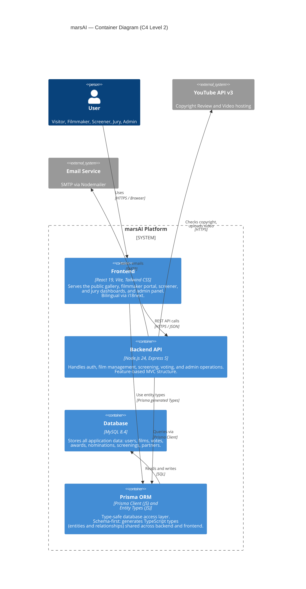
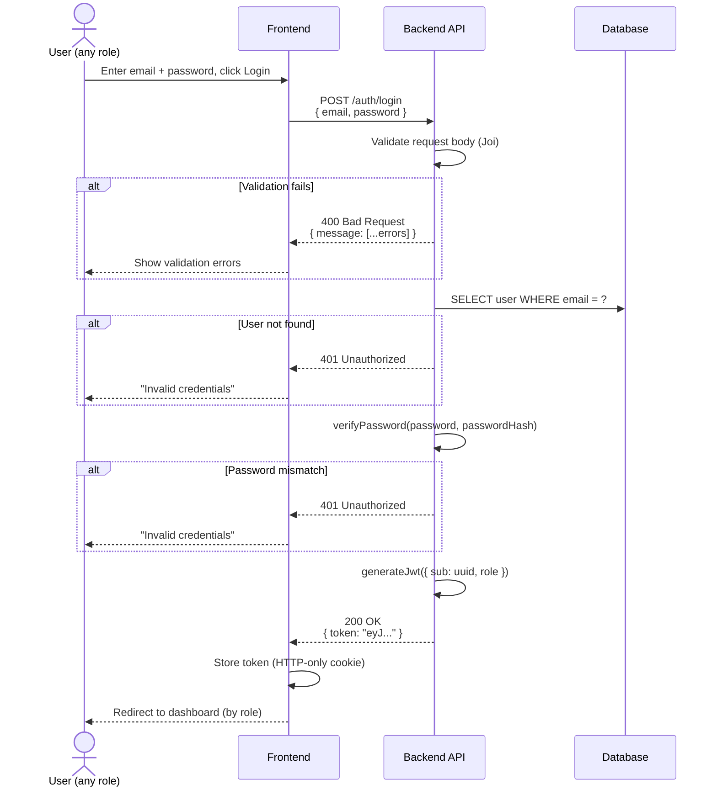
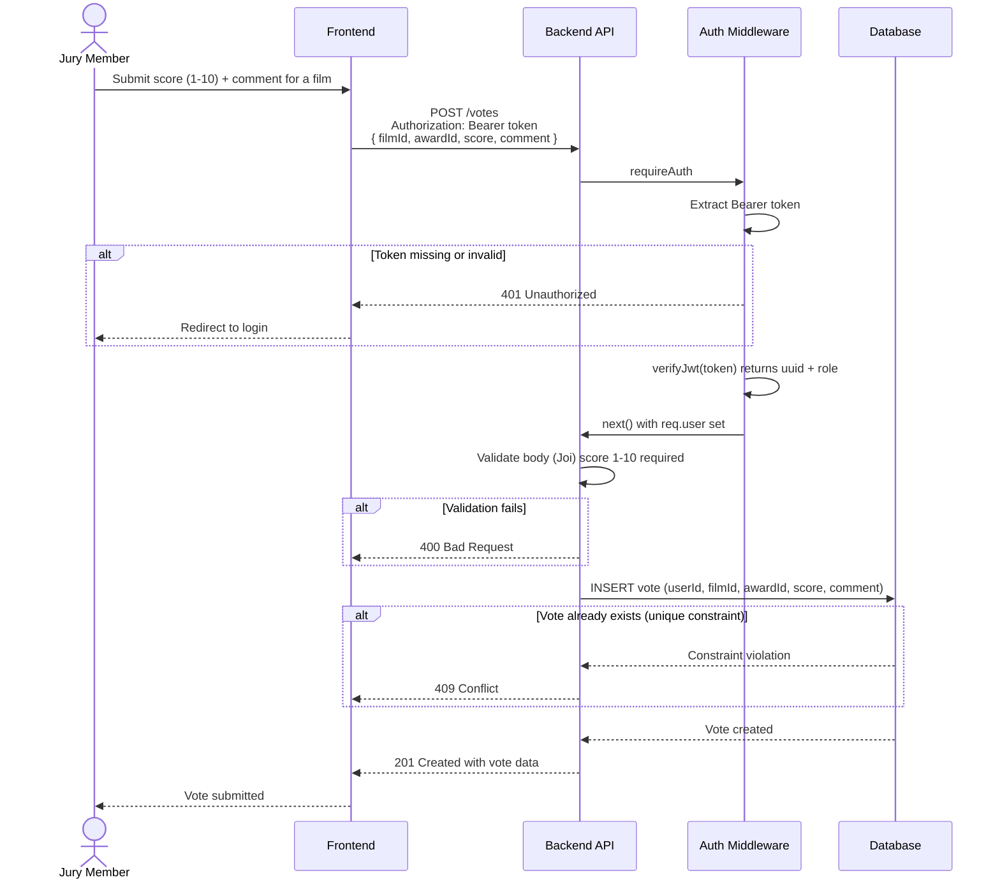
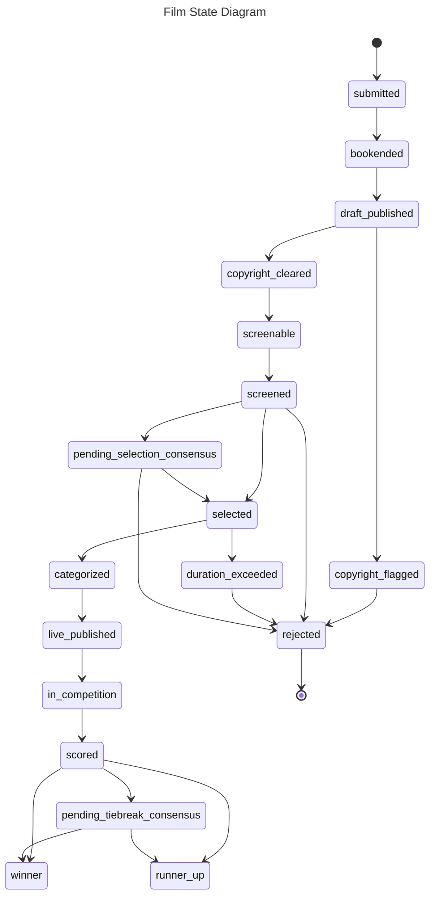
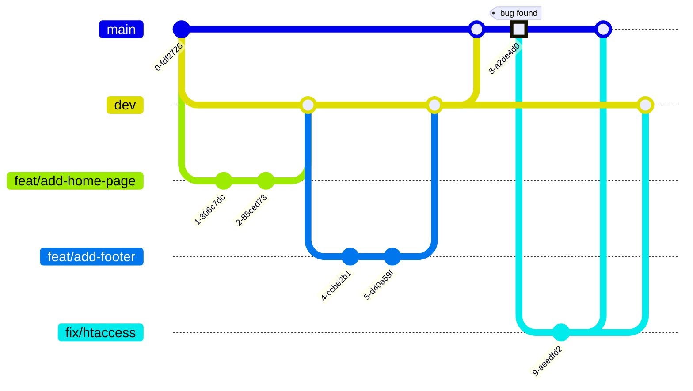

# Contributing to marsAI

## Welcome

Thank you for your interest in contributing to **marsAI**, the platform 
for the first international 1-minute AI-generated short film festival.

Whether you're fixing a bug, proposing a new feature, improving documentation, 
or writing tests, every contribution helps make this project better. 
This guide will walk you through the process of contributing.

If you have any questions, feel free to 
[open an issue](https://github.com/ebouchut/mars-ai-project/issues) on GitHub.

## Before You Start

### Code of Conduct

Make sure you read and agree to our [Code of Conduct](CODE_OF_CONDUCT.md).

### Prerequisites for Development

Read the [Prerequisites section of the README](README.md#prerequisites).

### Understanding the Codebase

#### Code Documentation

The code reference documentation [can be found here](https://www.ericbouchut.com/mars-ai-project/dev/). 


#### Architecture Overview

_marsAI_ is a Web-based client-server application 
using a MySQL database to persist information.



##### User Login Sequence Diagram



##### Vote Sequence Diagram 



##### Film State Diagram

Submitted **films** are stored on our platform,
then bookended (adding intro and outro segments), 
and uploaded to a private YouTube Channel for copyright review.

Once cleared for copyright, confirmed as 1-minute maximum length, 
and approved though the screening process, 
films move to the public YouTube channel
where jury members score them accross their assigned categories.
Each category has a 1 winner and at most 49 runner ups.




Where:

- `submitted`:         Film submitted and uploaded to the marsAI platform
- `bookended`:         The film is sandwiched between an intro at the beginning and an outro at the end (end credits).
- `draft_published`:   Published on the private YouTube channel, for copyright verification
- `live_published`:    Published and visible to everyone on the public YouTube channel
- `copyright_flagged`: Copyright infringement
- `copyright_cleared`: No copyright infringement
- `screenable`:        Viewable by members of the selection committee responsible for determining the official selection (grand prize).
- `screened`:          Viewed by a member of the selection committee
- `selected`:          Selected (part of the official selection of 50)
- `rejected`:          Rejected (not in the official selection)
- `pending_selection_consensus`: In a runoff, awaiting consensus with other selectors
- `duration_exceeded`: Film too long, director informed that he must shorten it and resubmit it.
- `categorized`:       Film nominated for the Grand Prize (official selection) and potentially for one or more other prizes
- `in_competition`:    Film in competition, voting(s) in progress
- `scored`:            Voting completed, film rated by **all** members of the jury
-  `winner`:           Prize winner
- `runner_up`:         Finalist (i.e., not winner)
- `pending_tiebreak_consensus`: Awaiting deliberation to decide between it and the other films with which it is tied


#### MonoRepo

We use a **monorepo**, that is a Git repository containing mainly both the **frontend and** the **backend**.

**Using a monorepo offers the following advantages:**

- **Shared code and types:**  
  The *frontend* and *backend* can share types, constants, and validation schemas from a single source of truth 
  (e.g. `@marsai/database`), avoiding duplication and keeping them in sync.
- **Atomic changes:**  
  A single commit or PR can update the database schema, backend API, and frontend together, ensuring they stay compatible.
- **Simplified dependency management:**  
  One `npm install` at the root installs everything.  
  Shared dependencies are hoisted and deduplicated automatically via *npm workspaces*.
- **Easier code reviews:**  
  Reviewers can see the full picture of a change (database + backend + frontend) in a single PR rather than coordinating across multiple repositories.
- **Consistent tooling and configuration:**    
  Linting rules, formatting, CI/CD pipelines, and Git hooks are configured once and apply to all packages.

#### Npm Packages

The project is composed of 3 `npm` packages scoped below the `@marsai` `npm` workspace:

- **`@marsai/database`**: Database schema, migrations, and generated JavaScript code
  (ORM client (query API), and types (models, enums) JS objects) (in `packages/database`)
- **`@marsai/backend`**:  Node/Express app (in `packages/backend`)
- **`@marsai/frontend`**: React app (in `packages/frontend`)
- **`@marsai/i18n`**: I18N strings (in `packages/i18n`)

`@marsai/backend` and `@marsai/frontend` depend on `@marsai/database`.   
The *frontend* only uses the types (models such as `Film`, `User`...) from `@marsai/database`.   
The *backend* uses everything from `@marsai/database`: the models and the ORM client code to interact with the database using JS objects.


#### Directory Structure

```txt
├── package.json
├── package-lock.json
├── node_modules/
├── packages
│    ├── database/
│    │    ├── .env.example
│    │    ├── package.json
│    │    ├── prisma/                         Contains database schema definition and migrations 
│    │    │   ├── schema.prisma               Database schema (Prisma syntax)
│    │    │   └── migrations/                 Database migrations (timestamped)
│    │    |       └── 20260130101437_add_is_active_to_users/
│    │    |           └─- migration.sql
│    │    └── src                     
│    │        └── generated/
│    │            └── prisma/
│    │                ├── models/            Generated TypeScript types for each Prisma model (e.g. User, Film, Vote)
│    │                │   └── Film.ts        Generated type for the Film model
│    │                │
│    │                ├── browser.ts         Prisma Client bundle for browser environments (types only)
│    │                └── client.ts          Prisma Client entry point for server-side (backend) use
│    ├── backend/
│    │    ├── .env.example
│    │    ├── package.json
│    │    ├── src/
│    │    │   ├── features/
│    │    │   │   │
│    │    │   │   └─── vote/                  Code related to the voting feature (backend)
│    │    │   │       ├── vote.routes.ts      Define routes to map URLs to controllers
│    │    │   │       ├── vote.controller.ts  Handle HTTP request/response
│    │    │   │       ├── vote.validation.ts  Validate input with Joi schemas
│    │    │   │       └── vote.service.ts     Handle the business logic operations
│    │    │   │
│    │    │   ├── common/                     Shared utilities, middlewares, and helpers used across features
│    │    │   │   ├── middlewares/
│    │    │   │   │   └── auth.middleware.ts  Express middleware that validates JWT and protects routes
│    │    │   │   │
│    │    │   │   └── utils/                  General-purpose utility functions
│    │    │   │       └── hash.ts             Password hashing and verification (Argon2id)
│    │    │   │
│    │    │   ├── integrations/               Adapters for external services (YouTube API, email)
│    │    │   │   ├── youtube/
│    │    │   │   │   ├── youtube.client.ts
│    │    │   │   │   └── youtube.service.ts
│    │    │   │   └── email/
│    │    │   │       ├── email.service.ts
│    │    │   │       └── templates/
│    │    │   │
│    │    │   ├── config/                     App-wide configuration (environment variables, Prisma client, constants)
│    │    │   │   ├── prisma.ts               Singleton Prisma client instance
│    │    │   │   ├── environment.ts          requireEnv() helper to read and validate required env variables
│    │    │   │   └── constants.ts            Application-wide constants
│    │    │   │
│    │    │   ├── loaders/                    Application bootstrapping — initializes subsystems before the server starts
│    │    │   │   ├── express.ts             Creates and configures the Express app (i18n, middleware, routes)
│    │    │   │   ├── routes.ts              Mounts all feature routers on the Express instance
│    │    │   │   └── i18n.ts                Initializes i18next with language detection and locale file loading
│    │    │   │
│    │    │   └── app.ts                     Entry point that builds and exports the configured Express app
│    │    │ 
│    │    ├── postman/                       Contains the Postman requests to test the REST endpoints
│    │    │   ├── marsai.environment.json    Postman environment file with placeholders (adjust to your local config.) 
│    │    │   └── marsai.collection.json     A single collection of Postman requests, with folders per feature  
│    │    │
│    │    └── tests/                         Test files mirroring the src/ folder structure
│    │        └── common/
│    │            └── utils/
│    │                └── hash.test.ts       Unit tests for the password hashing utility
│    │
     └── frontend/
         ├── package.json
         ├── .env.example
         ├── index.html                          Vite's HTML entry point
         ├── vite.config.ts
         ├── tailwind.config.ts
         ├── tsconfig.json
         ├── package.json
         ├── public/                             Static assets served as-is by Vite
         │   └── favicon.ico
         └── src/
             ├── main.tsx                        Vite entry point, mounts the React app
             ├── index.css                       Tailwind directives
             ├── App.tsx                         Root component, sets up routing
             │
             ├── components/                     Generic, domain-agnostic UI components (primitives)
             │   ├── YouTubeEmbed.tsx            generic primitive (no-domain knowledge)
             │   ├── Button.tsx
             │   ├── Modal.tsx
             │   └── Spinner.tsx
             │
             ├── shared/                         Domain-aware components used across features
             │   ├── FilmCard.tsx                Domain-aware component that wraps YouTubeEmbed
             │   └── UserAvatar.tsx
             │
             ├── pages/                          Thin routing shells only that assemble features
             │   ├── HomePage.tsx
             │   ├── FilmGalleryPage.tsx
             │   ├── JuryDashboardPage.tsx
             │   └── AdminDashboardPage.tsx
             │
             └── features/                       Feature-based modules (auth, film, vote...), each self-contained
                 │
                 ├── auth/                       Login, registration, JWT token management
                 │   ├── components/             React components that belong exclusively to THIS feature 
                 │   │   ├── LoginForm.tsx
                 │   │   └── RegisterForm.tsx
                 │   ├── hooks/                  Custom React hooks that manage state and behavior for this feature 
                 │   │   └── useAuth.ts          Manage what happens when the user interacts with the UI (logic but no JSX). 
                 │   ├── api/                    Communication with the backend REST endpoints (Data Access)
                 │   │   └── authApi.ts
                 │   └── types.ts                UI-only types: form values, token payload shape
                 │
                 ├── film/                       Public film gallery, film detail
                 │   ├── components/
                 .   │   ├── FilmGallery.tsx
                 .   │   ├── FilmDetail.tsx
                 .   │   └── FilmFilter.tsx
                     ├── hooks/
                     │   └── useFilmGallery.ts
                     ├── api/
                     │   └── filmsApi.ts
                     └── types.ts                UI-only: filter state, pagination shape
  ```

The table below explains what each folder entails.

| Folder                                   | Purpose                                                                                    |
|------------------------------------------|--------------------------------------------------------------------------------------------|
| `backend/src/features/`                  | Business domain modules, each self-contained (routes, controller, validation, service)     |
| `backend/src/common/`                    | Shared utilities, middlewares, and validators                                              |
| `backend/src/integrations/`              | External service connections (YouTube API, Email Service Provider)                         |
| `backend/src/config/`                    | Environment and application configuration                                                  |
| `backend/src/loaders/`                   | Application bootstrapping and initialization                                               |
| `backend/tests/`                         | Tests (mirrors the `src/` structure)                                                       |
| `frontend/public/`                       | Static Assets served as-is by Vite                                                         |
| `frontend/src/components/`               | Generic, domain-agnostic UI components (primitives)                                        |
| `frontend/src/shared/`                   | Domain-aware components used across features                                               |
| `frontend/src/pages/`                    | Thin routing shells only that assemble features                                            |
| `frontend/src/features/film/types.ts`    | UI-only types for this feature (`film`)                                                    |
| `frontend/src/features/film/components/` | React components that belong exclusively to this feature                                   |
| `frontend/src/features/film/hooks/`      | Custom React hooks that manage state and behavior for this feature                         |
| `frontend/src/features/film/api`         | Communication with backend REST endpoints related to this feature in order to fetch data   |


> [!NOTE]
> The backend feature folder does not contain `vote.model.js` nor `vote.dal.js`
because [Prisma](https://github.com/prisma/prisma), the ORM library we are using,
handles the model and Data Access Layer (DAL) for us.


#### Feature-based Folder Structure

The **backend** uses a **feature-based folder structure**.
where there is one folder per feature, for example: `packages/backend/src/features/vote` (singular).
This folder contains all the related files,
such as `vote.routes.ts`, `vote.controller.ts`, `vote.validation.ts`, and `vote.service.ts`.


#### File Naming Convention

- Folder: [snake_case](https://en.wikipedia.org/wiki/Snake_case)
- Files
    - **Backend** 
        - [snake_case](https://en.wikipedia.org/wiki/Snake_case)
        - Multi-part-naming for files in a feature folder: **`name.type.extension`**, contains 3 segments, where:
            - `name` may refer to a feature, middleware, service,
            - `type` refers to the type: `routes`, `controller`, `validation` (JSON validation), 
              `service` (handles business logic), `middleware` (TODO), `client` (adapter for an external service)
            - `extension` refers to the file extension such as `ts`  
        - Examples:
            - `backend/src/features/vote/vote.routes.ts`:     Define the voting routes (REST URLs to the voting controller's methods)
            - `backend/src/features/vote/vote.controller.ts`: Handle HTTP request/response
            - `backend/src/features/vote/vote.validation.ts`: Validate input with Joi schemas
            - `backend/src/features/vote/vote.service.ts`:    Handle the Business logic operations
            - `backend/src/common/middlewares/auth.middleware.ts`: Express middleware that validates JWT and protects routes
            - `backend/src/integrations/youtube/youtube.client.ts`:  Adapter for YouTube API
    - **Frontend** 
      - **[PascalCase](http://c2.com/cgi/wiki?PascalCase)** for **React components**.    
        The filename (`FilmCard.tsx`) and the JSX component name (`<FilmCard />`) use *PascalCase*. 
      - [camelCase](https://wiki.c2.com/?CamelCase) for everything else.  
        Any file that does not export a React component uses **camelCase**.

> [!TIP]
> **BACKEND** naming convention:
> 
> - [snake_case](https://en.wikipedia.org/wiki/Snake_case)
>     - multi-part-naming for feature related files: `vote.controller.ts`, `vote.service.ts` 

> [!TIP]
> **FRONTEND** naming convention:
> 
> If the file's default export is a **React component** — use **[PascalCase](http://c2.com/cgi/wiki?PascalCase)**.    
> For everything else — use **[camelCase](https://wiki.c2.com/?CamelCase)**. 


> [!NOTE]
> **What are `PascalCase` and `camelCase`?**
> 
> - **[PascalCase](http://c2.com/cgi/wiki?PascalCase)** is a naming convention where the first letter of every word 
>   is capitalized, with no spaces or underscores between words: `YouTubeEmbed`.
> - **[camelCase](https://wiki.c2.com/?CamelCase)** is a naming convention where the first word starts with a lowercase
>   letter and each subsequent word begins with an uppercase letter, with no spaces or underscores: `useJuryVote`.


#### Database Schema

This section describes how the database is structured.
The *marsAI* platform uses a MySQL relational database to persist entities.

We try to stick to
[Prisma's naming conventions](https://www.prisma.io/docs/orm/reference/prisma-schema-reference#naming-conventions)
for entities, fields, enums...


##### Database Naming Conventions

Here are the naming conventions for the **name** of our database **tables**:

- All lowercase
- Plural
- Use underscore for multi words names: `social_networks`
- Less than 64 characters (because of a MySQL constraint)

Do not use an underscore as the first character.


##### Database ERD Diagram

The **Entity Relationships Diagram** (ERD) is available as:

- an [SVG image](https://raw.githubusercontent.com/ebouchut/mars-ai-project/dev/docs/ERD.svg)
- a [page with a commented ERD diagram](docs/ERD.md)

> [!NOTE]
> This diagram uses [Crows's foot notation](https://mermaid.js.org/syntax/entityRelationshipDiagram.html#relationship-syntax)
> for the **cardinality of relationships**, where:
>
> - `o|` denotes `0..1` (zero or one)
> - `||` denotes Exactly one
> - `o{` denotes `0..n` (zero or more)

> [!TIP]
> If you want to create an Entity Relationship Diagram (ERD) like this one,
> then take a look at [Mermaid.js](https://mermaid.js.org/intro/).
> With this syntax embedded in a Markdown file, GitHub issue,
> you can easily create many types of diagrams such as sequence/flow/class/state diagrams to only name a few.
>
> GitHub among many other [tools, IDEs and platforms support Mermaid diagrams](https://mermaid.js.org/ecosystem/integrations-community.html#community-integrations).
>
> To give Mermaid diagrams a whirl, you can use the [free online visual editor](https://mermaid.live/) to build your first diagram,
> share it with others and even export it to various formats.

## How to Contribute

### Reporting Bugs


### Suggesting Enhancements

#### Feature Request Template

### Finding Issues to Work On (good first issue, help wanted)


## Development Workflow

### Setting Up Your Development Environment

### Testing the API with Postman

The repository ships two files under `packages/backend/postman/` that let you
send requests to the backend API directly from [Postman](https://www.postman.com/):

| File | Purpose |
|---|---|
| `marsai.collection.json` | All API requests, grouped by feature |
| `marsai.environment.json` | Variables with placeholder values (no real credentials) |

#### Import the Postman collection

1. Open Postman.
2. Click **`Collections`** / **`Import`**.
3. Select `packages/backend/postman/marsai.collection.json`.

#### Import the Postman environment

1. Click **`Environments`** / **`Import`**.
2. Select `packages/backend/postman/marsai.environment.json`.
3. Select **marsAI – Local** as the active environment (top-right dropdown).

#### Configure the Postman Collection

Open the **`marsAI – Local`** environment in Postman and fill in the fields marked as placeholders:

| Variable | What to set                                                         |
|---|---------------------------------------------------------------------|
| `baseUrl` | URL of your local backend server (default: `http://localhost:3000`) |
| `loginEmail` | Email of a test account in your local database                      |
| `loginPassword` | Password for that account                                           |
| `authToken` | Leave empty for now — see next step                               |

> [!WARNING]
> Never commit real credentials. The environment file intentionally ships
> with empty secret fields (`authToken`, `loginPassword`). Fill them in
> locally; Postman keeps them on your machine only.

#### Authenticate with Postman

Most endpoints require a JWT. To obtain one:

1. Run **`Auth`** / **`Login`** (`POST /auth/login`).
2. Copy the `token` value from the response body.
3. Paste it into the `authToken` environment variable.

All subsequent requests that require authentication read `{{authToken}}` from
the environment automatically.

### Branching Strategy

> [!NOTE]
> This project uses a very lightweight **[Git Flow](https://danielkummer.github.io/git-flow-cheatsheet/)**
> branching workflow to develop, integrate, release new features, and fix bugs.
>
> **Why did we make this change?**
>
> Usually, `main` is the default branch and serves both for the "integration" and deployment to production,
> which makes these processes brittle.
>
> **What is this change about?**
>
> To facilitate the integration of several features, we created the `dev` branch.  
> This is where we share the common code with the team.  
> It also serves as an integration branch to ensure that all the merged-in features work properly.
>
> This new branching scheme makes `dev` the new default branch.
>
> [issue #1](https://github.com/ebouchut/mars-ai-project/issues/1) introduced this change.

We use a **monorepo**, meaning it contains both the **frontend and** the **backend**.

The **branches**:

- Main branch: **`dev`**
    - The repository uses this branch as the primary one for development and pull requests.
    - It acts as an "integration" branch contains the common code and serves as a safety net.
    - This branch contains the code shared with the team.
    - This is the **default branch**, meaning it is the one we are on
      after cloning this repository, where we merge our feature branches via PRs.
    - It is also where we test that the merged features do not break the website.    
      Once we are confident the code on `dev` can be deployed to production, we merge `dev` into `main`.
    - We should not commit directly to `dev`, but create a PR (Pull Request) to bring in changes.
    - We have configured `dev` to require two approvals before merging to `dev`.
- **`main`** contains the production-ready code.
    - This is where the team merges `dev` after ensuring that the new features on `dev`
      are working properly together.
    - This branch is used for deployment.

We create **temporary branches** to develop a **feature** or **fix** a bug:

- **`feat/my-feature-description-here`** denotes a feature branch.  
  The naming convention may seem a bit convoluted, but refer to the kind of branch it is (`feat`: this is a feature), and what the branch will bring when merged to `dev` (`my-feature-description-here` should be a quick, hyper-consise, and high level description of the feature, using just a few all-lowercase words separated with an hyphen).  
  For instance: `feat/add-footer`.
- **`fix/concise-bug-description-here`** a bug fix branch  
  We create a bug fix branch, such as `fix/broken-link-page-footer`, when the website breaks in production.




### Commit Message Convention

### Code Style and Formatting


### Reset the Development Database

This section explains how to reset the development database.
It may prove useful when you need to start from a blank slate.

> [!WARNING]
> Think twice before launching this command because it will **remove all the data in your database**.

```shell
# Running this command will DELETE ALL the DATA in your database!
npm run db:reset

# Shortcut for:
#   npm -w @marsai/database  run db:reset
# which runs:
#   npx -w @marsai/database prisma migrate reset
#   npx -w @marsai/database prisma db      seed
```

The `npm run db:reset` command:

1. drops then recreates the database schema that is the structure (tables...),
1. applies all database migrations to recreate the database changes in chronological order,
1. runs the [seed script](./packages/database/prisma/seed.ts) to populate the database.


### Apply the Latest Database Migrations

Once you have picked up the latest changes from the upstream `dev` branch,
you need to apply the latest database migrations as follows:

```shell
npx -w @marsai/database prisma migrate dev
```

### Update the Database Schema

> [!NOTE]
> **What is Prisma?**
The project uses [Prisma](https://www.prisma.io/), which is an ORM (Object Relation Mapper) and database migration tool.
The **database schema** [`packages/database/prisma/schema`](https://github.com/ebouchut/mars-ai-project/blob/dev/packages/database/prisma/schema.prisma)
contains the description of the **database structure**: entities, enums, relationships, and cardinalities.
It is the **source of truth**, which means you never modify the database directly,
> Prisma does it for you using the schema.


To add, remove, an entity or a field/property we need to update the database schema.
It serves as a source of truth and and is used to generate and update the database.

Here is the **workflow** to add/update/remove the database structure (table, table column, relationship, enum value).

> [!TIP]
> Run the `npx` commands **from the project root folder**.

1. **Update** the **database schema** in [`packages/database/prisma/schema`](https://github.com/ebouchut/mars-ai-project/blob/dev/packages/database/prisma/schema.prisma).
   Say for instance, you add the `emailVerifiedAt` property to the `User` entity, like so:
   ```prisma
   emailVerifiedAt  DateTime?  @db.Timestamp(0) @map("email_verified_at")
   ```
1. Generate the SQL migration file **and apply it to the development database**:
   ```shell
   # cd mars-ai-project
    npx -w @marsai/database prisma migrate dev --name add_email_verified_at_to_users
   ```
   This command:
   
    - generates a SQL migration script named `migration.sql` in `packages/database/prisma/migrations/TIMESTAMP_add_email_verified_at_to_users/`.
    - runs this script to apply the migration to the database which adds the `email_verified_at` column to the `users` table.
   
   Adjust the name (after `--name `) to reflect the actual changes.
2. Generate the [Prisma Client](https://www.prisma.io/docs/orm/prisma-client) code:
   ```shell
   # cd mars-ai-project
   npx -w @marsai/database prisma generate
   ```

> [!NOTE]
 > What is the Prisma client?
>
> The **Prisma client** code is composed of ORM type-safe classes:
> - **models** (such as `User`, `Film`, `Vote`), **enums**, and **input/output shapes**.
    >   You can find them in [`packages/database/src/generated/prisma/models/`](https://github.com/ebouchut/mars-ai-project/tree/dev/packages/database/src/generated/prisma/models).
> - **Query API**
    >     - **CRUD methods** for each model: `prisma.user.create()`, `prisma.film.findMany()`, `prisma.work.delete()`...
>     - **Query builder**: `where`, `include`, `select`, `orderBy`...
> - **Autocomplete** so that your IDE knows every field, relation, and filter available

> [!NOTE]
> **Why and when should I regenerate the Prisma client?**
>
> Each time you modify the database schema you need to regenerate the Prisma client code.
> This ensures the database schema and the code to query and model entities remain in sync.


The **backend** imports both the ORM **client** and the models (types):
```ts
import { PrismaClient }           from "@marsai/database/client";
import { User, Vote, Film, Jury } from "@marsai/database";
```

The **frontend** **only** imports **the models** (types).  
It does not need the client because it does not interact with the database.
```ts
import { User, Vote, Film, Jury } from "@marsai/database";
```


### Add Npm Dependencies

In the example below we **add** the following dependencies (`npm` packages in our case)
to the **frontend** (`@marsai/frontend`):

- Runtime dependencies
    - `react`
    - `react-dom`
- Development dependency:
    - `@types/react`


```shell
# IMPORTANT: run npm from the project root folder:
cd mars-ai-project

npm install react react-dom         -w @marsai/frontend
npm install --save-dev @types/react  -w @marsai/frontend
```

Where:

- The first `npm install` line, adds the `react` and `react-dom` **runtime** dependencies (also used in the production environment).
- The second line `npm install` line, adds a **development** dependency ,that will not be used in the production environment.
- `--save-dev` specify that the `@types/react` package is a development dependency that won't be used at runtime (production).
- `-w @marsai/frontend` specify where to add the npm packages: the _frontend_ npm workspace (in the `packages/frontend/` folder)

### Writing Tests

### Running Tests

The project uses [Vitest](https://vitest.dev/) as its testing framework across all packages.

**Resources:**
- [Vitest Getting Started](https://vitest.dev/guide/)
- [Vitest API Reference](https://vitest.dev/api/)
- [Testing Best Practices](https://vitest.dev/guide/features.html)

#### Run All Tests

From the project root:
```shell
npm test
```

This runs tests across all three packages (`@marsai/database`, `@marsai/backend`, `@marsai/frontend`).

#### Run Tests for a Specific Package

```shell
# Database tests
npm test -w @marsai/database

# Backend tests
npm test -w @marsai/backend

# Frontend tests
npm test -w @marsai/frontend
```

#### Test Modes

- **Watch mode** (default) — reruns tests on file changes:
  ```shell
  npm test -w @marsai/backend
  ```

- **Single run** — runs once and exits (useful for CI):
  ```shell
  npm run test:run -w @marsai/backend
  ```

- **With coverage** — generates coverage reports:
  ```shell
  npm run test:coverage -w @marsai/backend
  ```

- **With UI** — opens an interactive browser interface:
  ```shell
  npm run test:ui -w @marsai/backend
  ```

### Generating the Documentation

You can **generate** the code **documentation locally**:

```shell
npm run docs
```

To read the docs open **`docs/code/index.html`** in your browser.

> [!NOTE]
> We do not commit the local documentation to the repository. 
> It is gitignored.  
> However, when tagging a new release on GitHub, the CI will generate it automatically on GitHub.  

🔜
### Running the CI Locally


## Submitting Changes

### Creating a Pull Request

### Pull Request Checklist

### Review Process and Timeline


## Release Process
