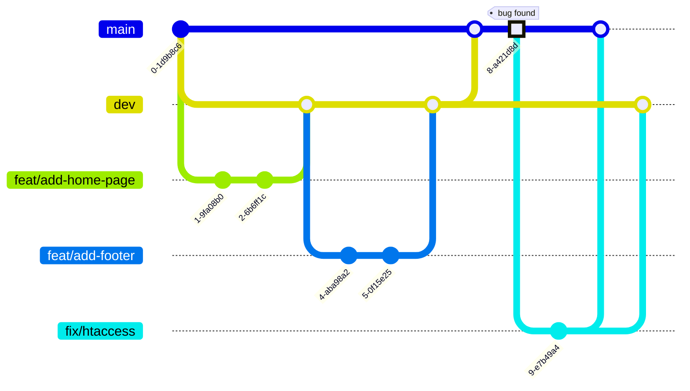

# marsAI - International AI Film Festival


## Description

*marsAI* is a Web platform for the first international short film festival featuring 1-minute films 
generated by Artificial Intelligence. 
This project is a co-creation between [La Plateforme](https://laplateforme.io) (digital school in Marseille) and the [Mobile Film Festival](https://www.mobilefilmfestival.com).


## Overview

*marsAI* celebrates human creativity at the intersection of filmmaking and artificial intelligence. 
The festival theme for this inaugural edition is **Imaginez des futurs souhaitables** (Imagine Desirable Futures).
The platform serves as the digital hub for film submissions, public viewing of finalist works, jury evaluation, and festival administration.

### Key Metrics

Based on *Mobile Film Festival*'s track record with international competitions, the project targets representation from over **120 countries**, more than **600 film submissions** during the call for projects, and a minimum of **3,000 visitors** at the physical event in **Marseille**.

From all submissions, **50 short films will be selected** for the official competition.

### Project Timeline

The project follows a 10-week development cycle divided into three phases: *Conception*, *UI/UX Design* (Figma), and *Development*.


## Features

### Submission Portal

Filmmakers create profiles, submit their 1-minute films, and document the AI tools used throughout their creative process. Videos are hosted externally on YouTube; the platform embeds them after copyright validation.

### Public Gallery

Visitors browse and watch all 50 finalist films. The gallery supports filtering by category, AI tool type, and keyword search. Social sharing and newsletter subscription are available without authentication.

### Jury Interface

A private, secure voting system allows jury members to rate films on a scale of 1 to 10 and provide comments. Each jury member has an individual dashboard to prevent influence from other members' ratings.

### Admin Dashboard

Administrators access moderation tools, partner management, and statistical insights including film origin by country and most-used AI tools.

### Copyright Verification

Integration with YouTube Data API validates music and image rights before submitted films hosted on YouTube are listed on the platform.

### Bilingual Support

The entire interface is available in *French* and *English* via i18n (internationalization).


## Tech Stack

- Dev Tooling:
  - [`npm`](https://en.wikipedia.org/wiki/Npm) version 11.7+
  - [fnm](https://github.com/Schniz/fnm) _Fast Node Manager_ permet d'installer et changer de version de Node.
      - [Instalation](https://github.com/Schniz/fnm?tab=readme-ov-file#installation) 
      - [Configuration](https://github.com/Schniz/fnm?tab=readme-ov-file#completions)
  - [`git`](https://en.wikipedia.org/wiki/Git) (ideally the latest version)
- Database:  
    - [MySQL](https://en.wikipedia.org/wiki/MySQL) version 8.4+
- Backend:  
    - [Express](https://expressjs.com/)
    - [Node.js](https://en.wikipedia.org/wiki/Node.js) version 24+
    - [Joi](https://joi.dev/) for input validation  
      We use Joi to define a schema that describes valid JSON data 
    - [Prisma](https://github.com/prisma/prisma) ORM
- Frontend:  
    - [React.js](https://en.wikipedia.org/wiki/React_(software))
    - Styling:  
        - [Tailwind CSS](https://en.wikipedia.org/wiki/Tailwind_CSS)
- Architecture:  
    - MVC Pattern

### Additional Requirements

- Unit testing on critical functions
- *WCAG* accessibility compliance
- Mobile First responsive design
- *Lighthouse* performance optimization


## Installation

- **Clone** the project  
  ```shell
  git clone https://github.com/ebouchut/mars-ai-project.git
  cd mars-ai-project
  ```
- Install **backend** dependencies  
  ```shell
  cd backend
  npm install
  ```
- Install **frontend** dependencies
  ```shell
  cd ../frontend
  npm install
  ```

## Configuration

### Databases Setup

Log in to MySQL as `root` and run the SQL script below to create the database user
and give her access to these databases.

But first-off, adjust the SQL script below to your likings: database name, database username and password below

```sql
-- Create the databases for the marsAI project and the database user
-- Replace the database names, username and password with your current configuration in .env.

CREATE DATABASE IF NOT EXISTS marsai                          DEFAULT CHARACTER SET utf8mb4;
CREATE DATABASE IF NOT EXISTS prisma_migrate_shadow_db_marsai DEFAULT CHARACTER SET utf8mb4;

CREATE USER IF NOT EXISTS marsai@localhost IDENTIFIED BY 'TODO_PASSWORD_HERE';

GRANT ALL PRIVILEGES ON marsai.*                          TO marsai@localhost;
-- See: https://www.prisma.io/docs/orm/prisma-migrate/understanding-prisma-migrate/shadow-database
GRANT ALL PRIVILEGES ON prisma_migrate_shadow_db_marsai.* TO marsai@localhost;
GRANT CREATE, DROP   ON *.*                               TO marsai@localhost;
FLUSH PRIVILEGES;
```

Where:

- `marsai` denotes the main database
- `prisma_migrate_shadow_db_marsai`  is a shadow database used by Prisma (the ORM and migration tool)
  to detect if a migration introduces unexpected changes such as schema drift and potential data loss.
  This database contains the N-1 version of the database (before the migration).

[backend/database/create-database.sql](https://github.com/ebouchut/mars-ai-project/blob/dev/backend/database/create-database.sql)
 always contains the most up-to-date version of this user and databases creation script.


### Environment Variables

> [!NOTE]
> The **environment variables** containing **sensitive information**
> (such as **database username and password**, database name...)
> should be declared in a file named **`.env`**.
> When starting up, the application:
>
> 1. reads the `.env` file,
> 1. exports the variables declared in this file as environment variables
> 1. access variables like so:
>     ```js
>     import 'dotenv/config'
>
>     // ...
>     env('DATABASE_URL')  // => Return the value of the DATABASE_URL
>     ```

> [!IMPORTANT]
> The `.env` file MUST NOT be under version control.
> Never ever git commit this file.

**Create and populate the `.env` file.**.

1. Copy the [`.env.example`](https://github.com/ebouchut/mars-ai-project/blob/dev/backend/.env.example) as `.env`
1. Edit and adjust the variables in `.env`

```shell
cd backend
cp .env.example .env

# Edit backend/.env and update the variables according to your development environment:
#   - DATABASE_HOST=TODO_HOST_HERE
#   - DATABASE_PORT=TODO_PORT_HERE
#   - DATABASE_USER=TODO_USERNAME_HERE
#   - DATABASE_PASSWORD=TODO_PASSWORD_HERE
#   - DATABASE_NAME=TODO_BATABASE_NAME_HERE
#
#   - DATABASE_URL=TODO_SEE_.env_FOR_DETAILS
#   - SHADOW_DATABASE_URL=TODO_SEE_.env_FOR_DETAILS
````

## Usage

### Running the Application

#### Development Mode

- Run the backend:
  ```shell
  cd backend
  npm run dev
  ```
- Run the frontend:
  ```shell
  cd frontend
  npm run dev
  ```

#### Production Mode


## Project Structure

The project uses a **feature-based folder structure**.

```
backend/
├── prisma/                         Contains database schema definition and migrations (with Prisma ORM syntax)
│   ├── schema.prisma               Database schema
│   ├── migrations/                 Database migrations
|   |   └── 20260130101437_add_is_active_to_users/
|   |       └─- migration.sql
│   └── seed.js                     
│
├── src/
│   ├── features/
│   │   │
│   │   +── vote/                   Contains code related to the voting feature
│   │       ├── vote.routes.ts      Define routes to map URLs to controllers
│   │       ├── vote.controller.ts  Handle HTTP request/response
│   │       ├── vote.validation.ts  Validate input with Joi schemas
│   │       └── vote.service.ts     Handle the Business logic operations
│   │
│   ├── common/
│   │   ├── middlewares/
│   │   │   ├── auth.middleware.js
│   │   │   ├── error.middleware.js
│   │   │   ├── role.middleware.js
│   │   │   ├── upload.middleware.js
│   │   │   └── validate.middleware.js
│   │   │
│   │   └── utils/
│   │       ├── api-error.js
│   │       ├── async-handler.js
│   │       ├── hash.js
│   │       └── token.js
│   │
│   ├── integrations/
│   │   ├── youtube/
│   │   │   └── youtube.service.ts
│   │   │
│   │   └── email/
│   │       ├── email.service.ts
│   │       └── templates/
│   │
│   ├── config/
│   │   ├── prisma.ts
│   │   ├── environment.ts
│   │   └── constants.ts
│   │
│   ├── loaders/
│   │   ├── express.ts
│   │   ├── routes.ts
│   │   └── i18n.ts
│   │
│   └── app.ts
│
├── tests/
├── .env.example
├── .gitignore
├── package.json
└── README.md
```

The table below explains what are the folders:  

| Folder          | Purpose                                                                                |
|-----------------|----------------------------------------------------------------------------------------|
| `features/`     | Business domain modules, each self-contained (routes, controller, validation, service) |
| `common/`       | Shared utilities, middlewares, and validators                                          |
| `integrations/` | External service connections (YouTube API, Email Service Provider)                     |
| `config/`       | Environment and application configuration                                              |
| `loaders/`      | Application bootstrapping and initialization                                           |
| `tests/`        | Tests (mirrors the `src/` structure)                                                   |

> [!NOTE]
> The feature folder does not contain `vote.model.js` nor `vote.dal.js`
because [Prisma](https://github.com/prisma/prisma), the ORM library we are using, 
handles the model and Data Access Layer (DAL) for us.

## Database Schema

This section describes how the database is structured.
The *marsAI* platform uses a relational database to persist entities.

### Database Naming Conventions

Here are the naming conventions for the **name** of our database **tables**:

- all lowercase
- plural
- use underscore for multi words names: `social_networks`
- less than 64 characters (because of a MySQL constraint)

Do not use an underscore as the first character.


### Database ERD Diagram

The Entity Relationships Diagram (ERD) is a draft.  
We will update it along the way.

```mermaid
---
title: marsAI Project - Entity Relationship Diagram (ERD)
config:
    layout: elk
---
erDiagram
    users {
      INT           id            PK
      VARCHAR(80)   email         UK             
      VARCHAR(255)  password_hash     "NOT NULL"
      ENUM          role              "NOT NULL (admin, filmmaker, screener, jury)"
      VARCHAR(60)    first_name        "NOT NULL"
      VARCHAR(255)   last_name         "NOT NULL"
      TEXT          bio
      VARCHAR(255)   photo
      TIMSTAMP      created_at
      TIMSTAMP      updated_at
    }
    films {
      INT            id            PK
      VACHAR(255)    name          UK
      VARCHAR(255)   video_url     UK
      VARCHAR(255)   poster_url
      TEXT           description
      ENUM           status            "NOT NULL (see: https://github.com/ebouchut/mars-ai-project/issues/22)"
    }
    nominations {
      INT             id           PK

      INT             film_id      FK "Composite UK part 1/2"
      INT             award_id     FK "Composite UK part 2/2"

      ENUM            status          "pending, nominated, winner, runner_up"
    }
    awards {
      INT             id           PK
      INT             partner_id   FK
      VARCHAR(30)     name         UK
      TEXT            description
      DECIMAL(10)     amount           "DECIMAL(10,2)"
      ENUM            amount_currency
    }
    screenings {
        INT           id            PK
        
        INT           user_id   FK
        INT           film_id       FK
        
        ENUM          status        "selected, rejected, pending_consensus"
    }
    user_social_networks {
        INT           id                 PK

        INT           user_id            FK, UK "Composite unique key part 1/3"
        INT           social_network_id  FK, UK "Composite unique key part 2/3"

        VARCHAR(255)  profile_url        UK     "Composite unique key part 3/3"       
    }
    social_networks {
        INT           id            PK
        VARCHAR(100)  name
        VARCHAR(255)  url           UK
    }
    works {
        INT           id            PK
        INT           user_id       FK "(filmmaker)"
        DATE          date
        VARCHAR(100)  name          UK "compound Unique Key (name + url)"
        VARCHAR(255)  url           UK "compound Unique Key (name + url)"
        TEXT          description
    }
    votes {
        INT           id            PK

        INT           user_id       FK "Unique constraint part 1/3 (jury)"
        INT           film_id       FK "Unique constraint part 2/3"
        INT           award_id      FK "Unique constraint part 2/3"

        INT           score            "NOT NULL (BETWEEN 1 AND 10)"
        TEXT          comment          "NOT NULL"
        TIMESTAMP     created_at       "NOT NULL"
        TIMESTAMP     updated_at       "NOT NULL"
    }
    partners {
        INT           id            PK
        VARCHAR(100)  name          UK
        VARCHAR(255)  description
        VARCHAR(255)  url              "NOT NULL"
        VARCHAR(255)  logo             "NOT NULL"
        INT           display_order    "DEFAULT 0"
        TIMESTAMP     created_at       "NOT NULL"
        TIMESTAMP     updated_at       "NOT NULL"
    }
    film_production_tools {
        INT           film_id             PK,FK
        INT           production_tool_id  PK,FK
    }
    production_tools {
        INT           id            PK
        VARCHAR(100)  name          UK
        TEXT          description
        VARCHAR(255)  url
    }
    newsletters {
        INT           id                 PK
        VARCHAR(150)  name               UK
        TIMESTAMP     last_published_at
        TIMESTAMP     created_at            "NOT NULL"
        TIMESTAMP     updated_at            "NOT NULL"
    }
    newsletter_subscriptions {
        INT           id                 PK
        INT           newsletter_id      FK
        VARCHAR(255)  email              UK
        ENUM          status                 "NOT NULL, (pending, subscribed, unsubscribed, error)"
        TIMESTAMP     subscribed_at          "NOT NULL (local subscription date)"
        
        INT           esp_subscriber_id      "Subscriber id  on the Email Service Provider (ESP)"
        TIMESTAMP     esp_synced_at          "When email was last synced/registered to Email Service Provider (ESP)"
        TIMESTAMP     esp_updated_at         "ESP’s **own** last update"

        TIMESTAMP     created_at
        TIMESTAMP     updated_at
    }
    jury_invitations {
      INT           id             PK
      VARCHAR(100)  email          UK
      VARCHAR(255)  token          "NOT NULL"
      
      TIMESTAMP     created_at     "NOT NULL, DEFAULT NOW()"
      TIMESTAMP     expires_at     "NOT NULL, DEFAULT NOW() + 7 days"
      TIMESTAMP     accepted_at    "NULL"
    }
    admins {
        INT           id            PK
        VARCHAR(255)  email         UK
        VARCHAR(100)  first_name        "NOT NULL"
        VARCHAR(255)  last_name         "NOT NULL"
        VARCHAR(255) password_hash      "NOT NULL"

        TIMESTAMP     created_at       "NOT NULL"
        TIMESTAMP     updated_at       "NOT NULL"
    }

    users                 o|..o{ user_social_networks : "(filmmaker) has a profile on"
    user_social_networks  o|..o{ social_networks      : "used by"

    users      o|..o{ works           : "(jury) portfolio"

    users      ||--o{ votes           : "(jury) cast a vote"
    votes      o{--|| films           : "scores"
    votes      o{--|| awards          : "for"

    users      ||--o{ screenings      : "screens a film"
    screenings o{--|| films           : "screened by"

    films       ||--}o nominations    : "is nominated"
    nominations o{--|| awards         : "for"

    partners    o|--}o awards         : "sponsors"

    films                 ||--}o film_production_tools   : "built with"
    film_production_tools o{--|o production_tools : "used in"

    newsletters o|..o{ newsletter_subscriptions : "registers"
```




> [!NOTE]
> This diagram uses [Crows's foot notation](https://mermaid.js.org/syntax/entityRelationshipDiagram.html#relationship-syntax) 
> for the **cardinality of relationships**, where:
>
> - `o|` denotes `0..1` (zero or one)
> - `||` denotes Exactly one
> - `o{` denotes `0..n` (zero or more)

> [!TIP]
> If you want to create an Entity Relationship Diagram (ERD) like this one, 
> then take a look at [Mermaid.js](https://mermaid.js.org/intro/).
> With this syntax embedded in a Markdown file, GitHub issue, 
> you can easily create many types of diagrams such as sequence/flow/class/state diagrams to only name a few.
>
> GitHub among many other [tools, IDEs and platforms support Mermaid diagrams](https://mermaid.js.org/ecosystem/integrations-community.html#community-integrations).
>
> To give Mermaid diagrams a whirl, you can use the [free online visual editor](https://mermaid.live/) to build your first diagram, 
> share it with others and even export it to various formats.


## API Documentation


## Testing


## Deployment


## Contributing

### Git Workflow

> [!NOTE]
> This project uses a lightweight **[Git Flow](https://danielkummer.github.io/git-flow-cheatsheet/)**
> branching workflow to develop, integrate, release new features, and fix bugs.
> 
> **Why did we make this change?**
> 
> Usually, `main` is the default branch and serves both for the "integration" and deployment to production,
> which makes these processes brittle.
> 
> **What is this change about?**
> 
> To facilitate the integration of several features, we created the `dev` branch.  
> This is where we share the common code with the team.  
> It also serves as an integration branch to ensure that all the merged-in features work properly.
> 
> This new branching scheme makes `dev` the new default branch.
> 
> [issue #1](https://github.com/ebouchut/mars-ai-project/issues/1) introduced this change.

We use a **monorepo**, meaning it contains both the **frontend and** the **backend**.

The **branches**:

- Main branch: **`dev`**  
    - The repository uses this branch as the primary one for development and pull requests.  
    - It acts as an "integration" branch contains the common code and serves as a safety net.
    - This branch contains the code shared with the team.  
    - This is the **default branch**, meaning it is the one we are on 
      after cloning this repository, where we merge our feature branches via PRs. 
    - It is also where we test that the merged features do not break the website.    
      Once we are confident the code on `dev` can be deployed to production, we merge `dev` into `main`.  
    - We should not commit directly to `dev`, but create a PR (Pull Request) to bring in changes. 
    - We have configured `dev` to require two approvals before merging to `dev`.
- **`main`** contains the production-ready code.  
    - This is where the team merges `dev` after ensuring that the new features on `dev` 
      are working properly together.
    - This branch is used for deployment.  

We create **temporary branches** to develop a **feature** or **fix** a bug:

- **`feat/my-feature-description-here`** denotes a feature branch.  
  The naming convention may seem a bit convoluted, but refer to the kind of branch it is (`feat`: this is a feature), and what the branch will bring when merged to `dev` (`my-feature-description-here` should be a quick, hyper-consise, and high level description of the feature, using just a few all-lowercase words separated with an hyphen).  
  For instance: `feat/add-footer`.  
- **`fix/concise-bug-description-here`** a bug fix branch  
  We create a bug fix branch, such as `fix/broken-link-page-footer`, when the website breaks in production.





## License

This project is developed for educational purposes as part of the CDPI program at [La Plateforme_](https://laplateforme.io) in partnership with [Mobile Film Festival](https://www.mobilefilmfestival.com).

🇺🇸 This project is dual-licensed under AGPL v3 for open source use and a commercial license for proprietary use. Contact ebouchut@gmail.com for commercial licensing.

🇫🇷 Ce projet est sous double licence AGPL v3 pour une utilisation open source et sous licence commerciale pour une utilisation propriétaire. Contactez ebouchut@gmail.com pour obtenir une licence commerciale.


## Authors

We are a team of five:

- Eva DAUMAS:  [GitHub](https://github.com/eva-daumas)
- Salah BELHASSAN: [GitHub](https://github.com/salah-eddine)
- Alex BACHIR: [LinkedIn](https://www.linkedin.com/in/alex-bachir-108ba5339/) | [GitHub](https://github.com/alex-bachir)
- Benjamin ASTIER: [GitHub](https://github.com/Septieme7)
- Eric BOUCHUT: [LinkedIn](https://linkedin.com/in/ebouchut) | [GitHub](https://github.com/ebouchut)

## Acknowledgments
