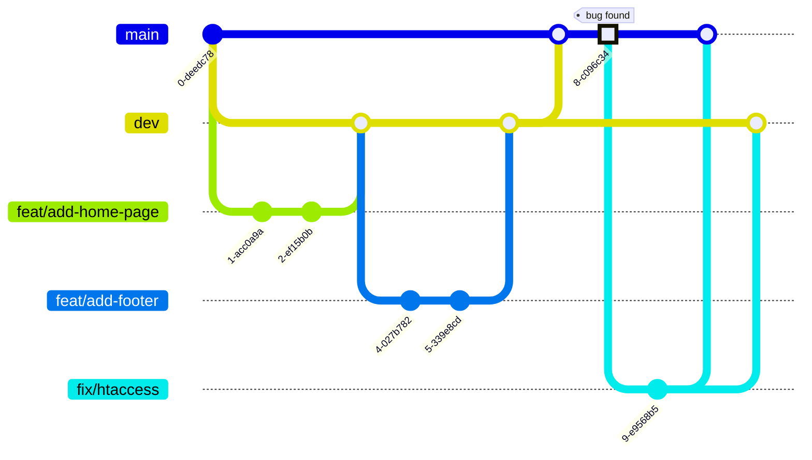

# marsAI - International AI Film Festival


## Description

Mars Artificial Intelligence Festival (*marsAI*) is a film festival in Marseille (France) 
for one-minute films made entirely by Artificial Intelligence.

This project is a co-creation between [La Plateforme](https://laplateforme.io) (digital school in Marseille) and the [Mobile Film Festival](https://www.mobilefilmfestival.com).


## Overview

*marsAI* celebrates human creativity at the intersection of filmmaking and artificial intelligence. 
The festival theme for this inaugural edition is **Imaginez des futurs souhaitables** (Imagine Desirable Futures).
The platform serves as the digital hub for film submissions, public viewing of finalist works, jury evaluation, and festival administration.

### Key Metrics

Based on *Mobile Film Festival*'s track record with international competitions, the project targets representation from over **120 countries**, more than **600 film submissions** during the call for projects, and a minimum of **3,000 visitors** at the physical event in **Marseille**.

From all submissions, **50 short films will be selected** for the official competition.

### Project Timeline

The project follows a 10-week development cycle divided into three phases: *Conception*, *UI/UX Design* (Figma), and *Development*.


## Features

### Submission Portal

Filmmakers create profiles, submit their 1-minute films, and document the AI tools used throughout their creative process. Videos are hosted externally on YouTube; the platform embeds them after copyright validation.

### Public Gallery

Visitors browse and watch all 50 finalist films. The gallery supports filtering by category, AI tool type, and keyword search. Social sharing and newsletter subscription are available without authentication.

### Jury Interface

A private, secure voting system allows jury members to rate films on a scale of 1 to 10 and provide comments. Each jury member has an individual dashboard to prevent influence from other members' ratings.

### Admin Dashboard

Administrators access moderation tools, partner management, and statistical insights including film origin by country and most-used AI tools.

### Copyright Verification

Integration with YouTube Data API validates music and image rights before submitted films hosted on YouTube are listed on the platform.

### Bilingual Support

The entire interface is available in *French* and *English* via i18n (internationalization).


## Tech Stack

- Dev Tooling:
  - [`npm`](https://en.wikipedia.org/wiki/Npm) version 11.7+
  - [fnm](https://github.com/Schniz/fnm) _Fast Node Manager_ allows installing and switching Node versions.
      - [Installation](https://github.com/Schniz/fnm?tab=readme-ov-file#installation)
      - [Configuration](https://github.com/Schniz/fnm?tab=readme-ov-file#completions)
  - [`git`](https://en.wikipedia.org/wiki/Git) (ideally the latest version)
- Database:  
    - [MySQL](https://en.wikipedia.org/wiki/MySQL) version 8.4+
- Backend:  
    - [Express](https://expressjs.com/)
    - [Node.js](https://en.wikipedia.org/wiki/Node.js) version 24+
    - [Joi](https://joi.dev/) for input validation  
      We use Joi to define a schema that describes valid JSON data 
    - [Prisma](https://github.com/prisma/prisma) ORM
- Frontend:  
    - [React.js](https://en.wikipedia.org/wiki/React_(software))
    - Styling:  
        - [Tailwind CSS](https://en.wikipedia.org/wiki/Tailwind_CSS)
- Architecture:  
    - MVC Pattern

### Additional Requirements

- Unit testing on critical functions
- *WCAG* accessibility compliance
- Mobile First responsive design
- *Lighthouse* performance optimization

## Prerequisites

Prerequisites

Before getting started, ensure the following software is installed with the required versions:

- **[`Git`](https://git-scm.com/install/)**: latest stable version
- [fnm (Fast Node Manager)](https://github.com/Schniz/fnm?tab=readme-ov-file#installation)
    - **macOS** (with [Homebrew](https://brew.sh)):  
      ```shell
      brew install fnm
      ```
      Then update your [shell dotfiles](https://github.com/Schniz/fnm?tab=readme-ov-file#shell-setup) 
    - **Windows**:  
- [Node.js}(https://nodejs.org/en/download): version 24+ LTS (important)    
  Install _Node.js_ and `npm` with `fnm`, like so:  
  ```shell
  cd  mars-ai-project
  fnm use
  ```
- MySQL: version 8.4+

## Installation

Make sure you meet the [prerequisites](#Prerequisites) which are necessary for the next steps.

- **Clone** the project  
  ```shell
  git clone https://github.com/ebouchut/mars-ai-project.git
  cd mars-ai-project
  ```
- Install **all** dependencies (`database`, `backend`, `frontend`)  
  ```shell
  # cd mars-ai-project  
  npm install         # From the project root folder
  ```

## Configuration

### Environment Variables

> [!NOTE]
> The **environment variables** containing **sensitive information**
> (such as **database username and password**, database name...)
> should be declared in a file named **`.env`**.
> When starting up, the application:
>
> 1. reads the `.env` file,
> 1. exports the variables declared in this file as environment variables
> 1. accesses variables like so:
>     ```js
>     import 'dotenv/config'
>
>     // ...
>     env('DATABASE_URL')  // => Return the value of the DATABASE_URL
>     ```

> [!IMPORTANT]
> The `.env` file MUST NOT be under version control.
> Never ever git commit this file.

**Create and populate the `.env` files.**

1. Copy [`.env.example`](https://github.com/ebouchut/mars-ai-project/blob/dev/packages/backend/.env.example) as `.env`
1. Edit and adjust the variables in `.env`

```shell
cd backend
cp .env.example .env

# Edit backend/.env and update the variables according to your development environment:
#   - DATABASE_HOST=TODO_HOST_HERE
#   - DATABASE_PORT=TODO_PORT_HERE
#   - DATABASE_USER=TODO_USERNAME_HERE
#   - DATABASE_PASSWORD=TODO_PASSWORD_HERE
#   - DATABASE_NAME=TODO_DATABASE_NAME_HERE
#
#   - DATABASE_URL=TODO_SEE_.env_FOR_DETAILS
#   - SHADOW_DATABASE_URL=TODO_SEE_.env_FOR_DETAILS
```

### Database Setup

#### Creating the Databases

You will now run **once** a SQL script below to create two databases and a database user.
Then you will give it access to these databases.


1. Make your own copy of the database creation script [packages/database/create-database.sql](https://github.com/ebouchut/mars-ai-project/blob/dev/packages/database/create-database.sql)
   ```sql
   -- Create the databases for the marsAI project and the database user
   -- Replace the database names, username and password with your current configuration in .env.
   
   CREATE DATABASE IF NOT EXISTS marsai                          DEFAULT CHARACTER SET utf8mb4;
   CREATE DATABASE IF NOT EXISTS prisma_migrate_shadow_db_marsai DEFAULT CHARACTER SET utf8mb4;
   
   CREATE USER IF NOT EXISTS marsai@localhost IDENTIFIED BY 'TODO_PASSWORD_HERE';
   
   GRANT ALL PRIVILEGES ON marsai.*                          TO marsai@localhost;
   -- See: https://www.prisma.io/docs/orm/prisma-migrate/understanding-prisma-migrate/shadow-database
   GRANT ALL PRIVILEGES ON prisma_migrate_shadow_db_marsai.* TO marsai@localhost;
   GRANT CREATE, DROP   ON *.*                               TO marsai@localhost;
   FLUSH PRIVILEGES;
   ```
   Where:
   - `marsai` denotes the main database
   - `prisma_migrate_shadow_db_marsai`  Prisma (the ORM and migration tool) 
     uses this shadow database to detect if a migration introduces unexpected changes such as schema drift and potential data loss.
     This database contains the N-1 version of the database (before the migration).
1. Edit the copy to adjust all the variables according to your current database configuration  
   (database name, database username and password...).
1. log in to MySQL as `root`
1. Run your copy of the SQL script 
1. Create the database **structure** (tables...) and add the **seeds**:
   ```shell
   cd mars-ai-project

   npm run db:migrate dev
   npm run db:seed
   ```


## Usage

### Running the Application

#### Development Mode

- Run the backend:
  ```shell
  # cd mars-ai-project
  npm run dev:backend
  ```
- Run the frontend:
  ```shell
  # cd mars-ai-project
  npm run dev:frontend
  ```


## Project Structure

The project uses a **feature-based folder structure**
where there is one folder per feature, for example: `packages/backend/src/features/vote` (singular).
This folder contains all the related files,
such as:`vote.routes.ts`, `vote.controller.ts`, `vote.validation.ts`, and `vote.service.ts`.

It is composed of 3 npm scoped packages:

- **`@marsai/database`**: Database schema and generated JavaScript code
  (database ORM client, and types mainly model JS objects) (in `packages/database`)
- **`@marsai/backend`**:  Node/Express app (in `packages/backend`)
- **`@marsai/frontend`**: React app (in `packages/frontend`)
 
`@marsai/backend` and `@marsai/frontend` depend on `@marsai/database`, but do not use the same thing.   
The *frontend* only uses the types (models such as `Film`, `User`...).   
The *backend* uses everything: the models and the ORM client code to interact with the database using JS objects.  

```
├── package.json
├── package-lock.json
├── node_modules/
├── packages
│    ├── database/
│    │    ├── .env.example
│    │    ├── package.json
│    │    ├── prisma/                         Contains database schema definition and migrations (with Prisma ORM syntax)
│    │    │   ├── schema.prisma               Database schema
│    │    │   └── migrations/                 Database migrations
│    │    |       └── 20260130101437_add_is_active_to_users/
│    │    |           └─- migration.sql
│    │    └── src                     
│    │        └── generated/
│    │            └── prisma/
│    ├── backend/
│    │    ├── .env.example
│    │    ├── package.json
│    │    ├── src/
│    │    │   ├── features/
│    │    │   │   │
│    │    │   │   └─── vote/                   Contains code related to the voting feature
│    │    │   │       ├── vote.routes.ts      Define routes to map URLs to controllers
│    │    │   │       ├── vote.controller.ts  Handle HTTP request/response
│    │    │   │       ├── vote.validation.ts  Validate input with Joi schemas
│    │    │   │       └── vote.service.ts     Handle the Business logic operations
│    │    │   │
│    │    │   ├── common/
│    │    │   │   ├── middlewares/
│    │    │   │   │   └── auth_middleware.ts
│    │    │   │   │
│    │    │   │   └── utils/
│    │    │   │       └── hash.ts
│    │    │   │
│    │    │   ├── integrations/
│    │    │   │   ├── youtube/
│    │    │   │   │   ├── youtube.client.ts
│    │    │   │   │   └── youtube.service.ts
│    │    │   │   └── email/
│    │    │   │       ├── email.service.ts
│    │    │   │       └── templates/
│    │    │   │
│    │    │   ├── config/
│    │    │   │   ├── prisma.ts
│    │    │   │   ├── environment.ts
│    │    │   │   └── constants.ts
│    │    │   │
│    │    │   ├── loaders/
│    │    │   │   ├── express.ts
│    │    │   │   ├── routes.ts
│    │    │   │   └── i18n.ts
│    │    │   │
│    │    │   └── app.ts
│    │    │
│    │    └── tests/
│    │
     └── frontend/
         ├── package.json
         ├── .env.example
  ```

The table below explains what are the folders:  

| Folder          | Purpose                                                                                |
|-----------------|----------------------------------------------------------------------------------------|
| `features/`     | Business domain modules, each self-contained (routes, controller, validation, service) |
| `common/`       | Shared utilities, middlewares, and validators                                          |
| `integrations/` | External service connections (YouTube API, Email Service Provider)                     |
| `config/`       | Environment and application configuration                                              |
| `loaders/`      | Application bootstrapping and initialization                                           |
| `tests/`        | Tests (mirrors the `src/` structure)                                                   |

> [!NOTE]
> The feature folder does not contain `vote.model.js` nor `vote.dal.js`
because [Prisma](https://github.com/prisma/prisma), the ORM library we are using, 
handles the model and Data Access Layer (DAL) for us.


## Database Schema

This section describes how the database is structured.
The *marsAI* platform uses a MySQL relational database to persist entities.

We try to stick to
[Prisma's naming conventions](https://www.prisma.io/docs/orm/reference/prisma-schema-reference#naming-conventions) 
for entities, fields, enums...


### Database Naming Conventions

Here are the naming conventions for the **name** of our database **tables**:

- All lowercase
- Plural
- Use underscore for multi words names: `social_networks`
- Less than 64 characters (because of a MySQL constraint)

Do not use an underscore as the first character.


### Database ERD Diagram

The **Entity Relationships Diagram** (ERD) is available as:

- an [SVG image](https://raw.githubusercontent.com/ebouchut/mars-ai-project/dev/docs/ERD.svg)
- a [page with a commented ERD diagram](docs/ERD.md)

> [!NOTE]
> This diagram uses [Crows's foot notation](https://mermaid.js.org/syntax/entityRelationshipDiagram.html#relationship-syntax) 
> for the **cardinality of relationships**, where:
>
> - `o|` denotes `0..1` (zero or one)
> - `||` denotes Exactly one
> - `o{` denotes `0..n` (zero or more)

> [!TIP]
> If you want to create an Entity Relationship Diagram (ERD) like this one, 
> then take a look at [Mermaid.js](https://mermaid.js.org/intro/).
> With this syntax embedded in a Markdown file, GitHub issue, 
> you can easily create many types of diagrams such as sequence/flow/class/state diagrams to only name a few.
>
> GitHub among many other [tools, IDEs and platforms support Mermaid diagrams](https://mermaid.js.org/ecosystem/integrations-community.html#community-integrations).
>
> To give Mermaid diagrams a whirl, you can use the [free online visual editor](https://mermaid.live/) to build your first diagram, 
> share it with others and even export it to various formats.


## API Documentation


## Testing

See [#running-tests](Running Tests) section.

## Deployment


## Contributing

### Running Tests

The project uses [Vitest](https://vitest.dev/) as its testing framework across all packages.

**Resources:**
- [Vitest Getting Started](https://vitest.dev/guide/)
- [Vitest API Reference](https://vitest.dev/api/)
- [Testing Best Practices](https://vitest.dev/guide/features.html)

#### Run All Tests

From the project root:
```shell
npm test
```

This runs tests across all three packages (`@marsai/database`, `@marsai/backend`, `@marsai/frontend`).

#### Run Tests for a Specific Package

```shell
# Database tests
npm test -w @marsai/database

# Backend tests
npm test -w @marsai/backend

# Frontend tests
npm test -w @marsai/frontend
```

#### Test Modes

- **Watch mode** (default) — reruns tests on file changes:
  ```shell
  npm test -w @marsai/backend
  ```

- **Single run** — runs once and exits (useful for CI):
  ```shell
  npm run test:run -w @marsai/backend
  ```

- **With coverage** — generates coverage reports:
  ```shell
  npm run test:coverage -w @marsai/backend
  ```

- **With UI** — opens an interactive browser interface:
  ```shell
  npm run test:ui -w @marsai/backend
  ```

### Git Workflow

> [!NOTE]
> This project uses a very lightweight **[Git Flow](https://danielkummer.github.io/git-flow-cheatsheet/)**
> branching workflow to develop, integrate, release new features, and fix bugs.
> 
> **Why did we make this change?**
> 
> Usually, `main` is the default branch and serves both for the "integration" and deployment to production,
> which makes these processes brittle.
> 
> **What is this change about?**
> 
> To facilitate the integration of several features, we created the `dev` branch.  
> This is where we share the common code with the team.  
> It also serves as an integration branch to ensure that all the merged-in features work properly.
> 
> This new branching scheme makes `dev` the new default branch.
> 
> [issue #1](https://github.com/ebouchut/mars-ai-project/issues/1) introduced this change.

We use a **monorepo**, meaning it contains both the **frontend and** the **backend**.

The **branches**:

- Main branch: **`dev`**  
    - The repository uses this branch as the primary one for development and pull requests.  
    - It acts as an "integration" branch contains the common code and serves as a safety net.
    - This branch contains the code shared with the team.  
    - This is the **default branch**, meaning it is the one we are on 
      after cloning this repository, where we merge our feature branches via PRs. 
    - It is also where we test that the merged features do not break the website.    
      Once we are confident the code on `dev` can be deployed to production, we merge `dev` into `main`.  
    - We should not commit directly to `dev`, but create a PR (Pull Request) to bring in changes. 
    - We have configured `dev` to require two approvals before merging to `dev`.
- **`main`** contains the production-ready code.  
    - This is where the team merges `dev` after ensuring that the new features on `dev` 
      are working properly together.
    - This branch is used for deployment.  

We create **temporary branches** to develop a **feature** or **fix** a bug:

- **`feat/my-feature-description-here`** denotes a feature branch.  
  The naming convention may seem a bit convoluted, but refer to the kind of branch it is (`feat`: this is a feature), and what the branch will bring when merged to `dev` (`my-feature-description-here` should be a quick, hyper-consise, and high level description of the feature, using just a few all-lowercase words separated with an hyphen).  
  For instance: `feat/add-footer`.  
- **`fix/concise-bug-description-here`** a bug fix branch  
  We create a bug fix branch, such as `fix/broken-link-page-footer`, when the website breaks in production.




### Add npm Packages

To **add** `npm` packages to the npm **frontend** workspace (`@marsai/frontend`):

- Go the project root folder:  
  ```shell
  cd mars-ai-project  # cd $(git rev-parse --show-toplevel)
  
  npm install react react-dom         -w @marsai/frontend
  npm install --save-dev @types/react  -w @marsai/frontend
  ```

Where:

- The first `npm install` line, adds the `react` and `react-dom` **runtime** dependencies (also used in the production environment).
- The second line `npm install` line, adds a **development** dependency ,that will not be used in the production environment.
- `--save-dev` specify that the `@types/react` package is a development dependency that won't be used at runtime (production). 
- `-w @marsai/frontend` specify where to add the npm packages: the _frontend_ npm workspace (in the `packages/frontend/` folder) 

### Understanding the Prisma ORM

The [Prisma Client](https://www.prisma.io/docs/orm/prisma-client) is auto-generated TypeScript code 
that provides a type-safe API to query the database.
It needs to be regenerated each time the database schema changes to ensure they remain in sync.

It's generated by running either of these commands from your modified database schema `packages/database/prisma/schema.prisma`:
- the shorter variant:
  ```shell
  npm run db:generate
  ```
- or the exhaustive variant:
  ```shell
  npm run prisma generate -w @marsai/database
  ```

> [!NOTE]
> Run these commands **from the project root folder**.

[Prisma](https://www.prisma.io/docs) generates:

- **CRUD methods** for each model: `prisma.user.create()`, `prisma.film.findMany()`, `prisma.work.delete()`...
- TypeScript **types for all models**, enums, and input/output shapes
- **Query builder**: type-safe `where`, `include`, `select`, `orderBy`...
- **Autocomplete** so that your IDE knows every field, relation, and filter available


### Updating the Database Schema

To add, remove, an entity or a field/property we need to update the database schema.
It serves as a source of truth and is used to generate and update the database. 

Here is what the procedure to change the database structure looks like:
- **Update the database schema**: (in `packages/database/prisma/schema.prisma`)  
   (add/update/remove entities, fields, relationships)
- Create and apply the database migration script (SQL) to your local database:  
  ```shell
  npm run migrate dev -w @marsai/database -- --name add-deletedat-to-user
  ```
  Adjust the [kebab-case](https://en.wikipedia.org/wiki/Letter_case#Kebab_case) name (after `--name `) 
  `add-deletedat-user` in this example to describe your changes. 
- Update the ORM TypeScript code (that provides a type-safe API to query the database):  
  ```shell
  npm run db:generate
  ```
  This command does the following for you:
    - update the model classes used by the backend and the frontend (in `packages/database/src/generated/models/`)
    - update the "client" only used by the backend to query the database   (in `packages/database/src/generated/prisma`)
This code needs to re-generated each time you update the database schema. 

> [!NOTE]
> Run the npm commands from the project root folder. 

Once your teammates will pick up the latest changes from the `dev` branch, 
they need to apply the new migrations like so:

```shell
npm run db:migrate dev

# equivalent to:
# npm run prisma migrate dev -w @marsai/database
```

## License

This project is developed for educational purposes as part of the CDPI program at [La Plateforme_](https://laplateforme.io) in partnership with [Mobile Film Festival](https://www.mobilefilmfestival.com).

🇺🇸 This project is dual-licensed under AGPL v3 for open source use and a commercial license for proprietary use. Contact ebouchut@gmail.com for commercial licensing.

🇫🇷 Ce projet est sous double licence AGPL v3 pour une utilisation open source et sous licence commerciale pour une utilisation propriétaire. Contactez ebouchut@gmail.com pour obtenir une licence commerciale.


## Authors

We are a team of five:

- Eva DAUMAS:  [GitHub](https://github.com/eva-daumas)
- Salah BELHASSAN: [GitHub](https://github.com/salah-eddine)
- Alex BACHIR: [LinkedIn](https://www.linkedin.com/in/alex-bachir-108ba5339/) | [GitHub](https://github.com/alex-bachir)
- Benjamin ASTIER: [GitHub](https://github.com/Septieme7)
- Eric BOUCHUT: [LinkedIn](https://linkedin.com/in/ebouchut) | [GitHub](https://github.com/ebouchut)

## Acknowledgments
