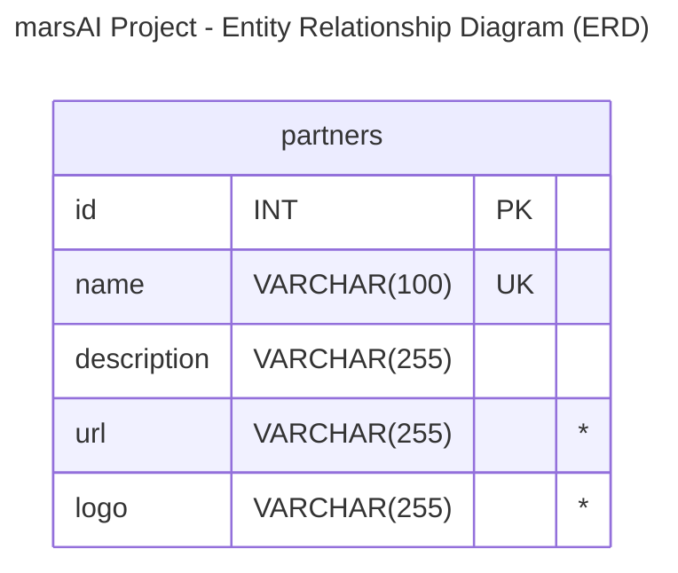

# marsAI - International AI Film Festival

A web platform for the first international short film festival featuring 1-minute films 
generated by Artificial Intelligence. 
This project is a co-creation between [La Plateforme](https://laplateforme.io) (digital school in Marseille) and the [Mobile Film Festival](https://www.mobilefilmfestival.com).


## Overview

*marsAI* celebrates human creativity at the intersection of filmmaking and artificial intelligence. 
The festival theme for this inaugural edition is **Imaginez des futurs souhaitables** (Imagine Desirable Futures).
The platform serves as the digital hub for film submissions, public viewing of finalist works, jury evaluation, and festival administration.

### Key Metrics

Based on *Mobile Film Festival*'s track record with international competitions, the project targets representation from over **120 countries**, more than **600 film submissions** during the call for projects, and a minimum of **3,000 visitors** at the physical event in **Marseille**.

From all submissions, **50 short films will be selected** for the official competition.

### Project Timeline

The project follows a 10-week development cycle divided into three phases: *Conception*, *UI/UX Design* (Figma), and *Development*.


## Features

### Submission Portal

Filmmakers create profiles, submit their 1-minute films, and document the AI tools used throughout their creative process. Videos are hosted externally on YouTube; the platform embeds them after copyright validation.

### Public Gallery

Visitors browse and watch all 50 finalist films. The gallery supports filtering by category, AI tool type, and keyword search. Social sharing and newsletter subscription are available without authentication.

### Jury Interface

A private, secure voting system allows jury members to rate films on a scale of 1 to 10 and provide comments. Each jury member has an individual dashboard to prevent influence from other members' ratings.

### Admin Dashboard

Administrators access moderation tools, partner management, and statistical insights including film origin by country and most-used AI tools.

### Copyright Verification

Integration with YouTube Data API validates music and image rights before submitted films hosted on YouTube are listed on the platform.

### Bilingual Support

The entire interface is available in *French* and *English* via i18n (internationalization).

## Tech Stack

- Database:  
    - [MySQL](https://en.wikipedia.org/wiki/MySQL) version 8.4+
- Backend:  
    - [Express](https://expressjs.com/)
    - [Node.js](https://en.wikipedia.org/wiki/Node.js) version 24+
- Frontend:  
    - [React.js](https://en.wikipedia.org/wiki/React_(software))
    - Styling:  
        - [Tailwind CSS](https://en.wikipedia.org/wiki/Tailwind_CSS)
- Architecture:  
    - MVC Pattern
- Dev Tooling:
    - [`npm`](https://en.wikipedia.org/wiki/Npm) version 11.7+
    - [`git`](https://en.wikipedia.org/wiki/Git) (ideally the latest version)

### Additional Requirements

- Unit testing on critical functions
- *WCAG* accessibility compliance
- Mobile First responsive design
- *Lighthouse* performance optimization


## Installation

- **Clone** the project  
  ```shell
  git clone https://github.com/ebouchut/mars-ai-project.git
  cd mars-ai-project
  ```
- Install **backend** dependencies  
  ```shell
  cd server
  npm install
  ```
- Install **frontend** dependencies
  ```shell
  cd ../client
  npm install
  ```

## Configuration


### Environment Variables

### Database Setup


## Running the Application

### Development Mode

### Production Mode


## Project Structure

## Database Schema

This section describes how the database is structured.
The *marsAI* platform uses a relational database to manage users, films, ratings, and partners.

### Database Naming Conventions

Here are the naming conventions for the name of our database tables:

- all lowercase
- plural
- use underscore for multi words names: `social_networks`
- less than 64 characters (because of a MySQL constraint)

Do not use an underscore as the first character.


### Database ERD Diagram

The below Entity Relationships Diagram (ERD) is preliminary draft showing the entities and their relationships.  
Wi will update it along the way.




The `*` in the above ERD diagram denotes a required field.

## API Documentation


## Testing


## Deployment


## Contributing


### Branching Workflow

This project uses a lightweight **[Git Flow](https://danielkummer.github.io/git-flow-cheatsheet/)** 
branching workflow to develop, integrate, release new features, and fix bugs.

**Why did we make this change?**

Usually, `main` is the default branch and serves both for the "integration" and deployment to production, 
which makes these processes brittle.

**What is this change about?**

To facilitate the integration of several features, we added another branch named `dev`. This is where we share the common code with the team. It also serves as an integration branch to ensure that all the merged-in features work properly. 

This new branching scheme makes `dev` the new default branch.

The **main branches** are:

- **`dev`**: This "integration" branch contains the common code and serves as a safety belt.
  This branch contains the code shared with the team.  
  This is the **default branch**, meaning the one we are on after cloning this repository, where we merge our feature branches via PRs (or not), and where we test that the merged features do not break the website. And once we are confident the code on `dev` can be deployed to production, we merge `dev` into `main`.  
  We do commit directly to `dev`, but create a PR (Pull Request) to bring in changes. We configured `dev` to require 2 approvals before merging to `dev`. 
- **`main`** contains the production-ready code.  
  This is where the team merges `dev` after ensuring that the new features on `dev` are working properly together.  
  We never commit directly to `main`.

The other branches are created to develop a feature or fix a bug:
- **`feat/my-feature-description-here`** denotes a feature branch.  
  The naming convention may seem a bit convoluted, but refer to the kind of branch it is (`feat`: this is a feature), and what the branch will bring when merged to `dev` (`my-feature-description-here` should be a quick, hyper-consise, and high level description of the feature, using just a few all-lowercase words separated with an hyphen).  
  For instance: `feat/add-footer`.  
  **`fix/concise-bug-description-here`** a bug fix branch  
  We create a bug fix branch, such as `fix/broken-link-page-footer`, when the website breaks in production.


[issue #1](https://github.com/ebouchut/mars-ai-project/issues/1) introduced this change.

## License

This project is developed for educational purposes as part of the CDPI program at [La Plateforme_](https://laplateforme.io) in partnership with [Mobile Film Festival](https://www.mobilefilmfestival.com).

We still need to [choose a license](https://github.com/ebouchut/mars-ai-project/issues/20) for the repository.

## Authors

We are a team of five:

- Eva DAUMAS:  [GitHub](https://github.com/eva-daumas)
- Salah BELHASSAN: [GitHub](https://github.com/salah-eddine)
- Alex BACHIR: [LinkedIn](https://www.linkedin.com/in/alex-bachir-108ba5339/) | [GitHub](https://github.com/alex-bachir)
- Benjamin ASTIER: [GitHub](https://github.com/Septieme7)
- Eric BOUCHUT: [LinkedIn](https://linkedin.com/in/ebouchut) | [GitHub](https://github.com/ebouchut)

## Acknowledgments
