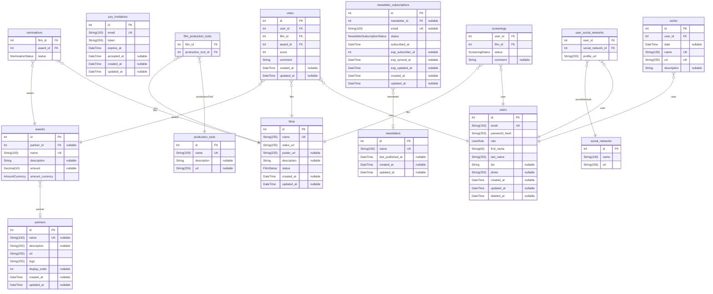

# Mars AI Project - Detailed ERD Diagram

> Generated by [`prisma-markdown`](https://github.com/samchon/prisma-markdown)

- [default](#default)

## default

### `awards`

Properties as follows:

- `id`:
- `partner_id`:
- `name`:
- `description`:
- `amount`:
- `amount_currency`:

### `film_production_tools`

Properties as follows:

- `film_id`:
- `production_tool_id`:

### `films`

Properties as follows:

- `id`:
- `name`:
- `video_url`:
- `poster_url`:
- `description`:
- `status`:
- `created_at`:
- `updated_at`:

### `jury_invitations`

Properties as follows:

- `id`:
- `email`:
- `token`:
- `expires_at`:
- `accepted_at`:
- `created_at`:
- `updated_at`:

### `newsletter_subscriptions`

This model or at least one of its fields has comments in the database, and requires an additional setup for migrations: Read more: https://pris.ly/d/database-comments

Properties as follows:

- `id`:
- `newsletter_id`:
- `email`:
- `status`:
- `subscribed_at`:
- `esp_subscriber_id`:
- `esp_synced_at`:
- `esp_updated_at`:
- `created_at`:
- `updated_at`:

### `newsletters`

Properties as follows:

- `id`:
- `name`:
- `last_published_at`:
- `created_at`:
- `updated_at`:

### `nominations`

Properties as follows:

- `film_id`:
- `award_id`:
- `status`:

### `partners`

Properties as follows:

- `id`:
- `name`:
- `description`:
- `url`:
- `logo`:
- `display_order`:
- `created_at`:
- `updated_at`:

### `production_tools`

Properties as follows:

- `id`:
- `name`:
- `description`:
- `url`:

### `screenings`

Properties as follows:

- `user_id`:
- `film_id`:
- `status`:
- `comment`:

### `social_networks`

Properties as follows:

- `id`:
- `name`:
- `url`:

### `user_social_networks`

Properties as follows:

- `user_id`:
- `social_network_id`:
- `profile_url`:

### `users`

Properties as follows:

- `id`:
- `email`:
- `password_hash`:
- `role`:
- `first_name`:
- `last_name`:
- `bio`:
- `photo`:
- `created_at`:
- `updated_at`:
- `deleted_at`:

### `votes`

Properties as follows:

- `id`:
- `user_id`:
- `film_id`:
- `award_id`:
- `score`:
- `comment`:
- `created_at`:
- `updated_at`:

### `works`

Properties as follows:

- `id`:
- `user_id`:
- `date`:
- `name`:
- `url`:
- `description`:
