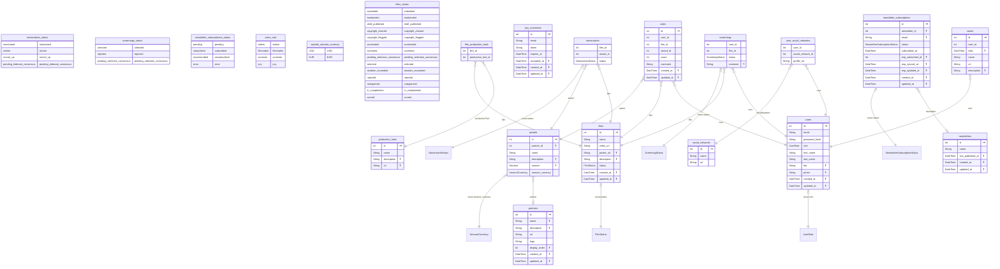

```mermaid
erDiagram

        nominations_status {
            nominated nominated
winner winner
runner_up runner_up
pending_tiebreak_consensus pending_tiebreak_consensus
        }
    


        screenings_status {
            selected selected
rejected rejected
pending_selection_consensus pending_selection_consensus
        }
    


        newsletter_subscriptions_status {
            pending pending
subscribed subscribed
unsubscribed unsubscribed
error error
        }
    


        users_role {
            admin admin
filmmaker filmmaker
screener screener
jury jury
        }
    


        awards_amount_currency {
            USD USD
EUR EUR
        }
    


        films_status {
            submitted submitted
bookended bookended
draft_published draft_published
copyright_cleared copyright_cleared
copyright_flagged copyright_flagged
screenable screenable
screened screened
pending_selection_consensus pending_selection_consensus
selected selected
duration_exceeded duration_exceeded
rejected rejected
categorized categorized
in_competation in_competation
scored scored
        }
    
  "awards" {
    Int id "🗝️"
    Int partner_id "❓"
    String name 
    String description "❓"
    Decimal amount "❓"
    AmountCurrency amount_currency 
    }
  

  "film_production_tools" {
    Int film_id 
    Int production_tool_id 
    }
  

  "films" {
    Int id "🗝️"
    String name 
    String video_url 
    String poster_url "❓"
    String description "❓"
    FilmStatus status 
    DateTime created_at "❓"
    DateTime updated_at "❓"
    }
  

  "jury_invitations" {
    Int id "🗝️"
    String email 
    String token 
    DateTime expires_at 
    DateTime accepted_at "❓"
    DateTime created_at "❓"
    DateTime updated_at "❓"
    }
  

  "newsletter_subscriptions" {
    Int id "🗝️"
    Int newsletter_id "❓"
    String email "❓"
    NewsletterSubscriptionStatus status 
    DateTime subscribed_at 
    Int esp_subscriber_id "❓"
    DateTime esp_synced_at "❓"
    DateTime esp_updated_at "❓"
    DateTime created_at "❓"
    DateTime updated_at "❓"
    }
  

  "newsletters" {
    Int id "🗝️"
    String name 
    DateTime last_published_at "❓"
    DateTime created_at "❓"
    DateTime updated_at "❓"
    }
  

  "nominations" {
    Int film_id 
    Int award_id 
    NominationStatus status 
    }
  

  "partners" {
    Int id "🗝️"
    String name "❓"
    String description "❓"
    String url 
    String logo 
    Int display_order "❓"
    DateTime created_at "❓"
    DateTime updated_at "❓"
    }
  

  "production_tools" {
    Int id "🗝️"
    String name 
    String description "❓"
    String url "❓"
    }
  

  "screenings" {
    Int user_id 
    Int film_id 
    ScreeningStatus status 
    String comment "❓"
    }
  

  "social_networks" {
    Int id "🗝️"
    String name 
    String url 
    }
  

  "user_social_networks" {
    Int user_id 
    Int social_network_id 
    String profile_url 
    }
  

  "users" {
    Int id "🗝️"
    String email 
    String password_hash 
    UserRole role 
    String first_name 
    String last_name 
    String bio "❓"
    String photo "❓"
    DateTime created_at "❓"
    DateTime updated_at "❓"
    }
  

  "votes" {
    Int id "🗝️"
    Int user_id 
    Int film_id 
    Int award_id 
    Int score 
    String comment 
    DateTime created_at "❓"
    DateTime updated_at "❓"
    }
  

  "works" {
    Int id "🗝️"
    Int user_id 
    DateTime date "❓"
    String name 
    String url 
    String description "❓"
    }
  
    "awards" |o--|| "AmountCurrency" : "enum:amount_currency"
    "awards" }o--|o partners : "partner"
    "film_production_tools" }o--|| films : "film"
    "film_production_tools" }o--|| production_tools : "productionTool"
    "films" |o--|| "FilmStatus" : "enum:status"
    "newsletter_subscriptions" |o--|| "NewsletterSubscriptionStatus" : "enum:status"
    "newsletter_subscriptions" }o--|o newsletters : "newsletter"
    "nominations" |o--|| "NominationStatus" : "enum:status"
    "nominations" }o--|| awards : "award"
    "nominations" }o--|| films : "film"
    "screenings" |o--|| "ScreeningStatus" : "enum:status"
    "screenings" }o--|| films : "film"
    "screenings" }o--|| users : "user"
    "user_social_networks" }o--|| social_networks : "socialNetwork"
    "user_social_networks" }o--|| users : "user"
    "users" |o--|| "UserRole" : "enum:role"
    "votes" }o--|| awards : "award"
    "votes" }o--|| films : "film"
    "votes" }o--|| users : "user"
    "works" }o--|| users : "user"
```
